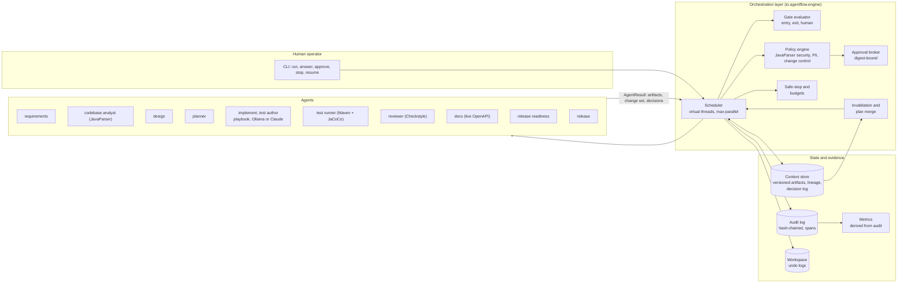
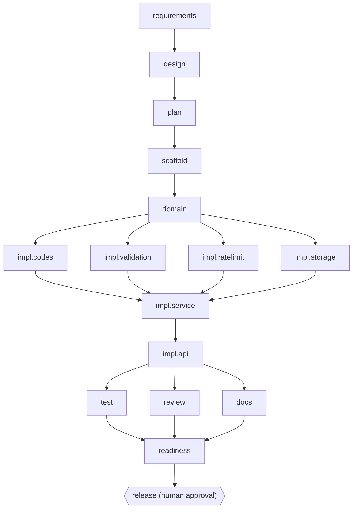
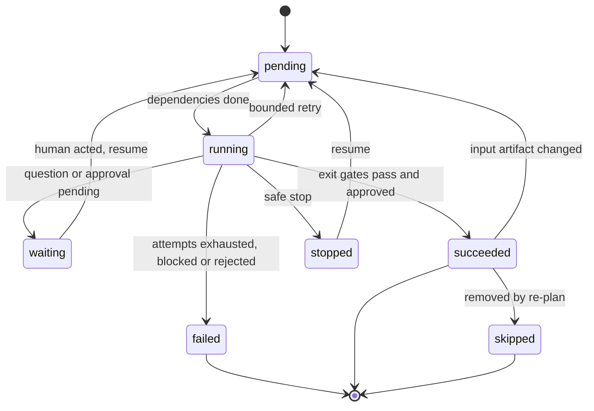

# Architecture

## 1. Components



| Component | Class | Key property |
|---|---|---|
| **Engine** | `engine/Engine` | Runs the graph and owns acceptance of every agent output. Agents never write to the workspace or decide their own success |
| **Graph** | `core/Graph` | Explicit DAG: dependencies, readiness, downstream blocking. Validated acyclic after every plan merge |
| **Gates** | `core/Gates` | Entry gates (may I start?) and exit gates (is the output acceptable?). They run real tools: Maven compile, Checkstyle, JUnit, JaCoCo, the live OpenAPI contract, a smoke test of the packaged JAR. A test gate passes only on Surefire evidence that each intended test class ran and passed (`core/SurefireReports`) |
| **Sandbox** | `core/Sandbox` | Every build, test and app run of generated code: allowlisted environment (no orchestrator secrets); under bubblewrap also no network (builds), no home or user files, read-only system and Maven cache, only its own workspace writable |
| **Policy** | `core/Policy` | Evaluates each change set *before* it touches disk. Java security rules work on the syntax tree (JavaParser), not on grep |
| **Approvals** | `core/Approvals`, `core/Approvers` | Human checkpoints bound to the digest of the complete outcome (workspace tree, change, policy findings, gate verdicts, input artifacts). Approvers authenticate with a token (salted hash in `config/approvers.yaml`) and need the role the request requires (`change`, `data`, `release`) |
| **Context store** | `core/ContextStore` | Versioned artifacts; each version records its producer and input versions. Any output traces back to the request and the human answers |
| **Audit** | `core/AuditLog` | Append-only JSONL, SHA-256 chained, trace id = run, span per attempt. `agentflow verify` detects edits and deletions |
| **Workspace** | `core/Workspace` | Applies change sets confined to the workspace root: no symlinks followed, file-type and size limits, expected-hash check (the file must still be what the change was planned against), two-phase atomic writes (stage all, then rename each; restore on failure). Every apply returns an undo log; crash-safe via in-flight logs |
| **Run ownership** | `core/RunLock`, `RunState` | One owner per run via an OS file lock (released if the owner dies, so another process can fail over); a fencing token in `state.json` refuses writes from a stale owner. Audit and approvals are appended under cross-process file locks |
| **Metrics** | `core/Metrics` | Success rate, retries, rollbacks, MTTR, latency, approvals, re-plans. Computed from the audit trail |
| **LLM clients** | `llm/OllamaClient`, `llm/ClaudeClient` | Structured output into Java records (Ollama `format` JSON schema; the Anthropic SDK's class-based structured output) |

## 2. Orchestration model

The delivery graph has two layers that live in **one DAG**:

1. **Stage skeleton** (`engine/Scenario`, fixed per pipeline):
   `requirements → [analyze] → design → plan → {test, review, docs} → readiness → release`
2. **Task nodes** inserted by the planner at run time (the decomposition), each with its own
   dependencies, declared write set, verification tests and impact.

`test`, `review` and `docs` are **join stages**. After every plan merge their dependencies are
set to "every active task", so implementation fans out in parallel and synchronises before
validation.

Example: the greenfield plan as executed.



### Node lifecycle



| From | To | When |
|---|---|---|
| pending | running | all dependencies succeeded or were skipped |
| running | waiting | a human gate is open (clarifying question) or an approval is pending |
| waiting | pending | the human answered or decided; picked up on `resume` |
| running | succeeded | exit gates pass (and approval granted, if required) |
| running | pending | retry: bounded attempts with backoff, next candidate or fallback agent |
| running | failed | attempts exhausted, policy block, or approval rejected. Downstream nodes become `blocked`; a critical node triggers safe stop |
| running | stopped | safe stop (STOP file, Ctrl+C, budget); resumable |
| succeeded | pending | an input artifact changed (invalidation) |
| succeeded | skipped | removed by a re-plan (its change is reverted) |

## 3. Control flow of one node

```
entry gates ─ fail(human) ─► WAITING            ─ fail(other) ─► FAILED
    │
    ▼
attempt k  (agent = primary, or fallback on the last attempt / after a provider error)
    │  agent.run() on a virtual thread ──► AgentResult{artifacts, change set, decisions}
    ▼
stage artifacts (versioned, with input lineage)
    ▼
Policy.evaluate(change set) ── block ─► nothing applied ─► diagnose ─► retry
    ▼
[workspace lock] write in-flight undo log → apply (all-or-nothing) → exit gates
    │                  fail ─► roll back + unstage ─► diagnose ─► retry (only with a matching repair)
    ▼
approval needed? (policy "approve" findings or a high-impact node)
    │   pending  ─► keep the verified change parked (pending undo log), WAITING
    │   rejected ─► roll back, FAILED, downstream BLOCKED, safe stop
    ▼   approved ─► (on resume) re-run the gates, recompute the outcome digest; same ─► commit,
    │                 different ─► approval invalidated, roll back, attempt again
commit undo log → SUCCEEDED → propagate changed artifacts → maybe merge a new plan
```

The exit gate of every implementation task is one sandboxed Maven invocation: `test-compile`,
Checkstyle and the task's declared tests (Surefire). It fails if a declared test file is missing,
and it reads the Surefire reports afterwards: every declared test class must have run with at
least one passing, non-skipped test. Stale reports are deleted first, so they can't count.

**Repair is diagnosis-driven.** A failure becomes a structured `Diagnosis` (`core/Diagnosis`):
phase (`compile`, `lint`, `tests`, `missing_tests`, `policy`, `apply`, `timeout`, ...), failing
tests, file:line locations and policy rules, recorded as `failure.diagnosed`. The deterministic
implementer starts with the task's primary change. After its own change fails, it may only use
a reviewed alternative whose manifest declares that it repairs this diagnosis (for example
`repairs: [{phase: tests, test: MigrationTest}]`); the choice is recorded as `repair.selected`.
If nothing matches, it raises `NoRepairException`: the node stops without blind retries and a
human decides. A timeout retries the same change. A model's failed attempt doesn't count
against the reviewed change, and the model gets the structured diagnosis in its next prompt.

Rules worth calling out:

* **Humans approve verified changes.** Approval is requested *after* the change has passed its
  gates in the sandbox workspace, with the gate results as evidence. A defective first attempt
  (the brownfield backfill migration) is rolled back without bothering a human, and the gates
  are re-run at the moment of approval.
* **Approval binds to the complete outcome.** The key is `node@outcome-digest`, where the
  digest covers the whole workspace tree (every file's hash), the change set, the policy
  findings, the gate verdicts and the versions of the input artifacts (for a release also the
  test, review, docs and readiness evidence). On resume the gates re-run and the digest is
  recomputed; anything different invalidates the approval (`approval.invalidated`).
* **Approvers are authenticated and role-checked.** `approve` needs the approver's token;
  a `data` approval (a migration on live data) or a `release` needs that role.
* **Write sets are an autonomy boundary.** An agent may only change the paths its task declared
  (`CHG-003`). Tasks with overlapping write sets are serialised by the planner, like a merge queue.
* **Bounded everything:** per-node attempts, exponential backoff capped at 2 s, per-run attempt
  and time budgets, a Maven timeout per build.

## 4. State, re-planning and resumption

Everything that crosses a stage boundary is an **artifact** in the context store:
`requirement_text`, `human_answers`, `requirements`, `impact_analysis`, `design`, `plan`,
`test_report`, `review_report`, `docs`, `release_readiness`, `release`. Each version records its
producer and the versions of its inputs, and each node records the input versions it consumed.

When a node produces a **changed** artifact, every consumer that saw an older version is
**invalidated** (back to pending). A human answer is a new version of `human_answers`, so
answering a question cascades naturally:

```
human_answers v2 → requirements v2 → impact_analysis v2, design v2 → plan v2 → plan merge
```

| Task in new plan vs live graph | Action |
|---|---|
| unchanged spec and deps | **reuse**: keep the result, no re-run (`node.reused`) |
| changed spec | revert its committed change (undo log), then re-run |
| new | add the node |
| no longer present | revert and mark `skipped` (`node.superseded`) |
| can't be reverted safely (a later change touched the same files) | keep it, and record a decision for human review |

**Persistence:** `state.json` is written atomically (temp file, fsync, rename) after every
scheduling step, and only by the run's current owner (fencing token). A crash between apply and commit leaves an `*.inflight.json` undo log, which is rolled back
on the next `resume`. A change parked for approval keeps a `*.pending.json` log.

**Concurrency:** workers are virtual threads. A state lock guards graph and node bookkeeping; a
separate, fair workspace lock is the merge queue, so agents (and model calls) run in parallel
while builds and change application are serialised.

**Ownership and failover:** `execute` and `answer` first take the run's lock (`runs/<id>/.lock`,
an OS file lock) and record `owner.json` (host, pid, purpose). A second process gets
`RunBusyException` naming the owner. If the owner dies, the OS releases the lock; the next
`resume` takes over, bumps the fencing token, rolls back any in-flight change, resets nodes
that were running, and continues. The old owner, if it is still alive, can no longer write
state (`FencedException`). `OwnershipTest` verifies this with a real `SIGKILL`ed process.

## 5. Governance and guardrails

| Rule | Severity | What it catches |
|---|---|---|
| SEC-000 | block | Generated Java that doesn't parse (JavaParser, Java 21 level) |
| SEC-001 | block | Committed secrets (AWS keys, private keys, GitHub/Anthropic tokens, hard-coded credentials; obvious fixture placeholders are allowed) |
| SEC-002 | block | `Runtime.exec`, `ProcessBuilder`, Java deserialization (`ObjectInputStream`, `readObject`), script-engine `eval`, and SQL built by concatenating non-literal values into JDBC calls |
| PII-001 | block | A schema column for raw personal identifiers (`ip`, `client_ip`, `email`, …) |
| CHG-001 | block | Forbidden paths (`.env`, keys, `.git/`, secrets) |
| CHG-003 | block | Writing outside the task's declared write set |
| DEP-001 | block | A dependency (including a build-plugin dependency) not on the allowlist (supply chain) |
| DATA-002 | block | Editing a released Flyway migration (checksums; schema changes must be a new `V<n>__` file) |
| DATA-001 | approve | A new migration against an existing database (live data at risk) |
| CHG-002 | approve | Modifying a protected file (`pom.xml`, CI, deploy, Dockerfile) |
| DEP-002 | approve | Adding an allowlisted dependency to an existing project |
| CHG-004 | approve | Change set larger than the review budget (generated files excluded) |
| high-impact node | approve | `release` (and any task declared `impact: high`) |

**Requirement coverage.** Every clause of the request (sentences, split on semicolons) gets a
disposition: `supported` (with the capabilities that cover it), `ambiguous` (a question),
`constraint` (a condition such as "existing clients must keep working", enforced by the
regression gates), or `unsupported`. An unsupported clause becomes a blocking question with two
options, `descope` (recorded as out of scope and in the release notes) or `stop`, so nothing
the requester asked for can disappear silently. Release readiness checks it.

**Feature-completion proof.** Each acceptance criterion has an id (`AC-<capability>-<n>`), and
product tests carry the ids they prove as JUnit tags (`@Tag("AC-expiry-2")`). Release readiness
finds the tags with JavaParser and requires, for every criterion of every delivered capability:
at least one tagged test that **passed** in the final suite (from the Surefire reports), and the
production code committed for it (its tasks' committed undo logs, under `src/main`) or the
existing modules that already implement it. The criterion → code → test table is in the report,
and it is part of the evidence the release approval is bound to.

Safe stop is triggered by `agentflow stop` (a `STOP` file), Ctrl+C, an exhausted attempt or
time budget, a failed **critical** node, or a rejected approval. Running attempts are interrupted
(their Maven builds are killed), an in-flight change is rolled back, and the run is left
`stopped` or `failed` but resumable.

## 6. Observability

* **Audit trail:** about 30 event types (`attempt.start/end`, `gate.entry/exit`,
  `policy.evaluated/blocked`, `change.applied/rolled_back/reverted`, `approval.requested/decided`,
  `human.answered`, `node.invalidated/reused/superseded`, `plan.created/revised`, `run.safe_stop`,
  …) with `trace_id` (run), `span_id` (attempt), actor (`orchestrator`, `agent:<name>`,
  `human:<name>`) and a SHA-256 hash chain.
* **Reliability metrics** (`metrics.json`, `agentflow metrics`):
  * node and attempt success rate, retries, rollbacks and rollback rate
  * **MTTR**: first failed attempt → next attempt that passes its gates (approval wait is
    reported separately)
  * active time vs wall time, per-stage latency, approvals and mean approval wait
  * re-plans, invalidations, reused nodes, policy blocks, LLM tokens
* **Report** (`report.md`): a readable view over the same evidence, including a Mermaid render of
  the live graph with node status.

## 7. Key decisions

| Decision | Why | Alternative rejected |
|---|---|---|
| One DAG with planner-inserted task nodes, not a fixed pipeline | Decomposition, parallelism and re-planning live in the structure the scheduler runs | A linear stage chain |
| Artifacts as the only cross-stage channel, versioned with lineage | Makes invalidation mechanical and decisions traceable | A shared mutable map |
| Human answers are artifacts | Clarification uses the same invalidation/re-plan path as any upstream change | Special-case "restart from requirements" |
| Approve *after* validation, bind to the outcome digest | Humans review evidence, not intentions; any later difference invalidates the approval | Approve-then-apply; bind to the diff only |
| Repairs declared against diagnoses | A retry must address the observed failure, or stop for a human | Next candidate by attempt number |
| bubblewrap sandbox, environment allowlist always | Generated code is untrusted: no secrets, no network for builds, no user files | Containers per build (heavier; see limitations) |
| OS file lock + fencing token for run ownership | Crash releases ownership automatically; a stale owner can't corrupt state | PID files (stale after a crash) |
| Virtual threads + a state lock + a merge-queue workspace lock | Agent and model work runs in parallel; builds see a consistent tree | Per-file locks (tests read across files) |
| One Maven invocation per task gate (compile + Checkstyle + tests) | About 7 s per task instead of three JVM start-ups; failure phase still reported | Separate gates per tool |
| Black-box regression tests for test-first brownfield work | Java compiles a module as a unit, so tests that reference not-yet-written classes would break the build; HTTP/migration tests compile against the existing code and fail at runtime until fixed | Unit tests written first (don't compile) |
| Release smoke test runs the packaged JAR on a free port | Tests the artifact that would ship, not just the test context | Smoke inside `@SpringBootTest` |
| Undo logs instead of git for rollback | Per-change, works mid-run, survives crashes | `git reset` (whole tree, breaks parallel work) |
| Deterministic default provider + Ollama/Claude | Reproducible demo and CI; identical governance for every provider | LLM-only |
| Metrics derived from the audit log | One source of truth | Separate counters |
