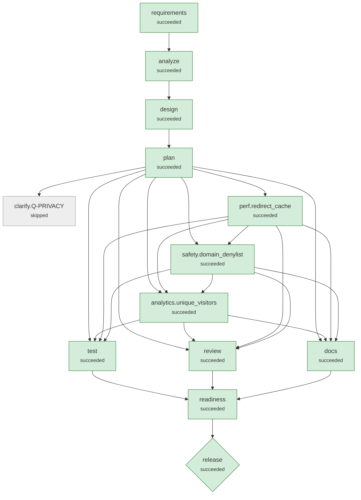

# Run demo-ambiguous-sample

**Scenario:** ambiguous: Product ask: safer links, marketing analytics, fast redirects  
**Status:** `succeeded`  
**Provider:** deterministic · **Playbook:** shortener-v2

## 1. Requirement

```text
Make short links safer and add some analytics so marketing can see how links perform.
Redirects should also be fast.
```

## 2. Requirement understanding

| Capability | Evidence in request | Acceptance criteria |
|---|---|---|
| analytics | Make short links safer and add some analytics so marketing can see how links perform. | Per-link total clicks, daily breakdown and top referrer hosts<br>Click recording never delays the redirect response |
| domain_denylist | Q-SAFETY -> denylist | Targets on a configurable domain denylist (incl. subdomains) are rejected with 400 |
| performance | Redirects should also be fast. | Redirect path meets the agreed latency target |
| redirect | Redirects should also be fast. | GET /{code} returns 302 to the target<br>Unknown codes return 404; deleted or expired codes return 410 |
| redirect_cache | Q-PERF -> p95-50ms | Hot redirects are served from a bounded in-process TTL cache<br>Deleting a link invalidates its cache entry immediately<br>Redirect p95 < 50 ms in-process |
| unique_visitors | Q-PRIVACY -> hashed | Stats report unique visitors per link<br>No raw IP address is ever persisted: visitors are a keyed, daily-rotating hash |
| url_safety | Make short links safer and add some analytics so marketing can see how links perform. | Only http(s) targets are accepted; script/data/file schemes are rejected with 400<br>URLs with embedded credentials are rejected |

**Requirement coverage** (every clause of the request has a disposition)

| Clause | Text | Disposition | Covered by |
|---|---|---|---|
| C1 | Make short links safer and add some analytics so marketing can see how links perform. | supported | analytics, url_safety |
| C2 | Redirects should also be fast. | supported | performance, redirect |

**Ambiguities detected**

| Id | Trigger | Question | Options | Resolution |
|---|---|---|---|---|
| Q-PRIVACY | Make short links safer and add some analytics so marketing can see how links perform. | Marketing will likely want unique visitors, which needs a per-visitor identifier (IP address). What may we store? | hashed, none, raw | hashed (human:reviewer) |
| Q-PERF | Redirects should also be fast. | 'Fast' has no target. Which latency objective should the redirect path meet? | p95-10ms, p95-50ms | p95-50ms (assumption) |
| Q-SAFETY | Make short links safer and add some analytics so marketing can see how links perform. | 'Safer' could mean several threat models. Which should this change cover? | baseline, denylist, reputation | denylist (assumption) |

**Assumptions**

- Q-PERF: assumed 'p95 < 50 ms in-process (read-through cache, no new infrastructure)' (non-blocking; confirm or override)
- Q-SAFETY: assumed 'Add a configurable domain denylist for known-bad domains' (non-blocking; confirm or override)

## 3. Codebase reasoning (brownfield)

- Class dependency graph: `{"com.example.shortener.ShortenerApplication":[],"com.example.shortener.config.AppConfig":["com.example.shortener.config.ShortenerProperties","com.example.shortener.service.TokenBucketRateLimiter"],"com.example.shortener.config.ShortenerProperties":[],"com.example.shortener.domain.Click":[],"com.example.shortener.domain.Errors":[],"com.example.shortener.domain.Link":[],"com.example.shortener.domain.LinkStats":[],"com.example.shortener.service.CodeGenerator":["com.example.shortener.domain.Errors"],"com.example.shortener.service.LinkRepository":["com.example.shortener.domain.Click","com.example.shortener.domain.Link"],"com.example.shortener.service.LinkService":["com.example.shortener.config.ShortenerProperties","com.example.shortener.domain.Click","com.example.shortener.domain.Errors","com.example.shortener.domain.Link","com.example.shortener.domain.LinkStats","com.example.shortener.service.CodeGenerator","com.example.shortener.service.LinkRepository","com.example.shortener.service.TtlCache","com.example.shortener.service.UrlValidator"],"com.example.shortener.service.TokenBucketRateLimiter":[],"com.example.shortener.service.TtlCache":[],"com.example.shortener.service.UrlValidator":["com.example.shortener.domain.Errors"],"com.example.shortener.web.ApiExceptionHandler":["com.example.shortener.domain.Errors","com.example.shortener.web.RequestIdFilter"],"com.example.shortener.web.ApiKeyAuth":["com.example.shortener.config.ShortenerProperties","com.example.shortener.domain.Errors","com.example.shortener.service.LinkService"],"com.example.shortener.web.Dtos":["com.example.shortener.domain.Link"],"com.example.shortener.web.HealthController":["com.example.shortener.service.LinkRepository"],"com.example.shortener.web.LinkController":["com.example.shortener.config.ShortenerProperties","com.example.shortener.domain.Errors","com.example.shortener.domain.LinkStats","com.example.shortener.service.LinkService","com.example.shortener.service.TokenBucketRateLimiter","com.example.shortener.web.ApiKeyAuth"],"com.example.shortener.web.RedirectController":["com.example.shortener.domain.Link","com.example.shortener.service.LinkService"],"com.example.shortener.web.RequestIdFilter":[]}`
- Blast radius: ["com.example.shortener.ShortenerApplication","com.example.shortener.config.AppConfig","com.example.shortener.config.ShortenerProperties","com.example.shortener.domain.Click","com.example.shortener.domain.Link","com.example.shortener.domain.LinkStats","com.example.shortener.service.CodeGenerator","com.example.shortener.service.LinkRepository","com.example.shortener.service.LinkService","com.example.shortener.service.TtlCache","com.example.shortener.service.UrlValidator","com.example.shortener.web.ApiKeyAuth","com.example.shortener.web.Dtos","com.example.shortener.web.HealthController","com.example.shortener.web.LinkController","com.example.shortener.web.RedirectController"]
- Data at risk: ["clicks","idempotency_keys","links"] (schema tables: ["clicks","idempotency_keys","links"])
- Regression tests selected: ["src/test/java/com/example/shortener/integration/ClickRecordingTest.java","src/test/java/com/example/shortener/integration/LinkServiceTest.java","src/test/java/com/example/shortener/unit/CodeGeneratorTest.java","src/test/java/com/example/shortener/unit/UrlValidatorTest.java"]

| Capability | Classes | Routes | Tables |
|---|---|---|---|
| analytics | ["com.example.shortener.config.AppConfig","com.example.shortener.domain.Click","com.example.shortener.domain.LinkStats","com.example.shortener.service.LinkRepository","com.example.shortener.service.LinkService","com.example.shortener.web.LinkController"] | ["GET /api/v1/links/{code}/stats"] | ["clicks","idempotency_keys","links"] |
| domain_denylist | ["com.example.shortener.service.CodeGenerator","com.example.shortener.service.TtlCache","com.example.shortener.service.UrlValidator"] | [] | [] |
| performance | [] | [] | [] |
| redirect | ["com.example.shortener.domain.Link","com.example.shortener.service.LinkService","com.example.shortener.web.RedirectController"] | ["GET /{code}"] | [] |
| redirect_cache | ["com.example.shortener.service.LinkService","com.example.shortener.web.RedirectController"] | ["GET /{code}"] | [] |
| unique_visitors | ["com.example.shortener.domain.LinkStats","com.example.shortener.service.LinkRepository","com.example.shortener.service.LinkService","com.example.shortener.web.LinkController"] | ["GET /api/v1/links/{code}/stats"] | ["clicks","idempotency_keys","links"] |
| url_safety | ["com.example.shortener.ShortenerApplication","com.example.shortener.config.ShortenerProperties","com.example.shortener.service.CodeGenerator","com.example.shortener.service.TtlCache","com.example.shortener.service.UrlValidator"] | [] | [] |

## 4. Design

Style: layered Spring Boot service: web -> service -> repository (JDBC) -> Flyway-managed schema

| ADR | Decision | Rationale | Alternatives |
|---|---|---|---|
| ADR-01 | Record clicks off the request thread; store referrer host + user-agent family only | Keeps redirect latency independent of analytics writes and minimises personal data. | Synchronous write (simpler, slower); Event queue such as Kafka (scales, more infrastructure) |
| ADR-02 | Configurable domain denylist, matched on domain suffix | Cheap, deterministic, auditable; reputation APIs add a vendor dependency. | Google Safe Browsing lookup (external dependency, latency) |
| ADR-03 | 302 + Cache-Control: no-store for redirects | Every click must reach the service for analytics; 301 is cached by browsers. | 301 Moved Permanently (cheaper, but under-counts) |
| ADR-04 | Bounded in-process TTL cache on the redirect path | Meets p95 < 50 ms with no new infrastructure; the TTL bounds staleness and delete invalidates. | Redis or CDN edge cache (needed only for p95 < 10 ms or multi-instance) |
| ADR-05 | Unique visitors via HMAC-SHA256(key, day \| IP \| user agent), truncated | Counts uniques per day without storing personal data; the daily key prevents tracking a visitor across days. | Store raw IPs (personal data, needs a legal basis); Cookies (consent banner needed) |
| ADR-06 | Validate targets at the boundary; never fetch them | Blocks script schemes, credential spoofing and internal hosts without network I/O. | Fetch-and-inspect targets (SSRF risk, latency) |

## 5. Plan (v2) and decomposition

| Task | Agent | Depends on | Writes | Verified by | Declared impact |
|---|---|---|---|---|---|
| perf.redirect_cache | implement | - | TtlCache.java, ShortenerProperties.java, LinkService.java, TtlCacheTest.java, RedirectPerformanceTest.java | ClickRecordingTest.java, LinkServiceTest.java, RedirectPerformanceTest.java, TtlCacheTest.java | low |
| safety.domain_denylist | implement | perf.redirect_cache | ShortenerProperties.java, UrlValidator.java, LinkService.java, IntegrationTest.java, DenylistTest.java, DenylistApiTest.java | ClickRecordingTest.java, DenylistApiTest.java, LinkServiceTest.java, DenylistTest.java, UrlValidatorTest.java | low |
| analytics.unique_visitors | implement | perf.redirect_cache, safety.domain_denylist | src/main/resources/db/migration/V2__visitor_hash.sql, ShortenerProperties.java, Click.java, LinkStats.java, LinkRepository.java, LinkService.java, Dtos.java, LinkController.java, RedirectController.java, VisitorAnalyticsTest.java | ApiIntegrationTest.java, ClickRecordingTest.java, LinkServiceTest.java, VisitorAnalyticsTest.java | low |

**Traceability (capability → tasks)**

- analytics: ["existing:AppConfig","existing:Click","existing:LinkStats","existing:LinkRepository","existing:LinkService","existing:LinkController"]
- domain_denylist: ["safety.domain_denylist"]
- performance: ["perf.redirect_cache"]
- redirect: ["existing:Link","existing:LinkService","existing:RedirectController"]
- redirect_cache: ["perf.redirect_cache"]
- unique_visitors: ["analytics.unique_visitors"]
- url_safety: ["existing:ShortenerApplication","existing:ShortenerProperties","existing:CodeGenerator","existing:TtlCache","existing:UrlValidator"]

## 6. Orchestration graph



Rectangles are stages and tasks; diamonds are high-impact nodes that require human approval.

## 7. Execution

| Node | Kind | Status | Attempts | Runs | Origin | Started | Finished | Note |
|---|---|---|---|---|---|---|---|---|
| requirements | stage | succeeded | 1 | 2 | scenario | 02:39:54 | 02:40:30 |  |
| analyze | stage | succeeded | 1 | 2 | scenario | 02:39:55 | 02:40:31 |  |
| design | stage | succeeded | 1 | 2 | scenario | 02:39:55 | 02:40:31 |  |
| plan | stage | succeeded | 1 | 2 | scenario | 02:39:56 | 02:40:31 |  |
| clarify.Q-PRIVACY | checkpoint | skipped | 0 | 0 | plan:v1 | 02:39:56 |  | waiting for a human answer to Q-PRIVACY: Marketing will likely want unique visitors, which needs a per-visitor identifier (IP address). What may we store? |
| perf.redirect_cache | task | succeeded | 1 | 1 | plan:v1 | 02:39:56 | 02:40:13 |  |
| safety.domain_denylist | task | succeeded | 1 | 1 | plan:v1 | 02:40:13 | 02:40:28 |  |
| analytics.unique_visitors | task | succeeded | 1 | 1 | plan:v2 | 02:40:31 | 02:41:02 |  |
| docs | stage | succeeded | 1 | 1 | scenario | 02:41:03 | 02:41:38 |  |
| review | stage | succeeded | 1 | 1 | scenario | 02:41:03 | 02:41:38 |  |
| test | stage | succeeded | 1 | 1 | scenario | 02:41:03 | 02:41:38 |  |
| readiness | stage | succeeded | 1 | 1 | scenario | 02:41:38 | 02:41:38 |  |
| release | stage | succeeded | 1 | 1 | scenario | 02:41:38 | 02:42:00 |  |

**Timeline (audit trail excerpts)**

- `02:39:54` **run.session.start**  {"fencing":1,"owner":"host-3da02335:548727:68f3dd2b","sandbox":"bwrap (fs + env + network isolation)","status":"created"}
- `02:39:55` **attempt.start** requirements {"agent":"requirements","attempt":1}
- `02:39:55` **agent.note** requirements {"note":"6 capabilities, 3 ambiguities, 1 blocking"}
- `02:39:55` **attempt.start** analyze {"agent":"codebase","attempt":1}
- `02:39:55` **agent.note** analyze {"note":"blast radius [ShortenerApplication, AppConfig, ShortenerProperties, Click, Link, LinkStats, CodeGenerator, LinkRepository, LinkService, UrlValidator, ApiKeyAuth, Dtos, HealthController, LinkController, RedirectC
- `02:39:55` **attempt.start** design {"agent":"design","attempt":1}
- `02:39:56` **attempt.start** plan {"agent":"planner","attempt":1}
- `02:39:56` **agent.note** plan {"note":"3 tasks; waiting on [Q-PRIVACY]"}
- `02:39:56` **plan.created** plan {"added":["perf.redirect_cache","safety.domain_denylist","clarify.Q-PRIVACY"],"changed":[],"plan_version":1,"removed":[],"reused":[]}
- `02:39:56` **attempt.start** perf.redirect_cache {"agent":"implement","attempt":1}
- `02:39:56` **agent.note** perf.redirect_cache {"note":"candidate 1/1: Q-PERF: bounded TTL read-through cache on the redirect path (p95 < 50 ms)"}
- `02:39:56` **node.waiting** clarify.Q-PRIVACY {"reason":"waiting for a human answer to Q-PRIVACY: Marketing will likely want unique visitors, which needs a per-visitor identifier (IP address). What may we store?"}
- `02:39:56` **change.applied** perf.redirect_cache {"added":202,"candidate":0,"digest":"8bf7270b7920fe6d","paths":["src/main/java/com/example/shortener/config/ShortenerProperties.java","src/main/java/com/example/shortener/service/LinkService.java","src/main/java/com/exam
- `02:40:13` **attempt.start** safety.domain_denylist {"agent":"implement","attempt":1}
- `02:40:13` **agent.note** safety.domain_denylist {"note":"candidate 1/1: Q-SAFETY: configurable domain denylist (incl. subdomains)"}
- `02:40:13` **change.applied** safety.domain_denylist {"added":78,"candidate":0,"digest":"d50e197f0bf94276","paths":["src/main/java/com/example/shortener/config/ShortenerProperties.java","src/main/java/com/example/shortener/service/LinkService.java","src/main/java/com/examp
- `02:40:28` **run.session.end**  {"status":"waiting","stop_reason":null,"waiting":["clarify.Q-PRIVACY"]}
- `02:40:29` **human.answered**  {"option":"hashed","question":"Q-PRIVACY"}
- `02:40:29` **node.invalidated** requirements {"reason":"input 'human_answers' changed to v2"}
- `02:40:30` **run.session.start**  {"fencing":3,"owner":"host-3da02335:549596:b1f78a7f","sandbox":"bwrap (fs + env + network isolation)","status":"waiting"}
- `02:40:30` **attempt.start** requirements {"agent":"requirements","attempt":1}
- `02:40:30` **node.waiting** clarify.Q-PRIVACY {"reason":"waiting for a human answer to Q-PRIVACY: Marketing will likely want unique visitors, which needs a per-visitor identifier (IP address). What may we store?"}
- `02:40:30` **agent.note** requirements {"note":"7 capabilities, 3 ambiguities, 0 blocking"}
- `02:40:30` **node.invalidated** analyze {"reason":"input 'requirements' changed to v2"}
- `02:40:30` **node.invalidated** design {"reason":"input 'requirements' changed to v2"}
- `02:40:30` **node.invalidated** plan {"reason":"input 'requirements' changed to v2"}
- `02:40:30` **attempt.start** analyze {"agent":"codebase","attempt":1}
- `02:40:31` **agent.note** analyze {"note":"blast radius [ShortenerApplication, AppConfig, ShortenerProperties, Click, Link, LinkStats, CodeGenerator, LinkRepository, LinkService, TtlCache, UrlValidator, ApiKeyAuth, Dtos, HealthController, LinkController,
- `02:40:31` **attempt.start** design {"agent":"design","attempt":1}
- `02:40:31` **attempt.start** plan {"agent":"planner","attempt":1}
- `02:40:31` **agent.note** plan {"note":"3 tasks; waiting on []"}
- `02:40:31` **node.reused** perf.redirect_cache {"plan_version":2}
- `02:40:31` **node.reused** safety.domain_denylist {"plan_version":2}
- `02:40:31` **node.superseded** clarify.Q-PRIVACY {"plan_version":2}
- `02:40:31` **plan.revised** plan {"added":["analytics.unique_visitors"],"changed":[],"plan_version":2,"removed":["clarify.Q-PRIVACY"],"reused":["perf.redirect_cache","safety.domain_denylist"]}
- `02:40:31` **attempt.start** analytics.unique_visitors {"agent":"implement","attempt":1}
- `02:40:31` **agent.note** analytics.unique_visitors {"note":"candidate 1/1: Q-PRIVACY=hashed: unique visitors via daily-rotating HMAC; raw IPs never stored"}
- `02:40:32` **change.applied** analytics.unique_visitors {"added":171,"candidate":0,"digest":"1fde64d5153a385a","paths":["src/main/java/com/example/shortener/config/ShortenerProperties.java","src/main/java/com/example/shortener/domain/Click.java","src/main/java/com/example/sho
- `02:40:48` **approval.requested** analytics.unique_visitors {"evidence":{"change_set":"1fde64d5153a385a","gates":["build=pass"],"plan":"04c5c0e6334ac8d2@v2","policy_findings":"e6c302e60110e8d6","requirements":"dd2374ce4b79c11a@v2","workspace_tree":"dfe6c3c615301543 (43 files)"},"
- `02:40:48` **node.waiting** analytics.unique_visitors {"reason":"approval required: DATA-001 src/main/resources/db/migration/V2__visitor_hash.sql: schema change against an existing database"}
- `02:40:48` **run.session.end**  {"status":"waiting","stop_reason":null,"waiting":["analytics.unique_visitors"]}
- `02:40:49` **approval.decided** analytics.unique_visitors {"authenticated":"token","by":"reviewer","comment":"no raw IPs; additive migration","decided_at":1.791340849231E9,"role":"data","status":"approved","subject":"bbe999c1ae329df0","waited_s":1.0}
- `02:40:50` **run.session.start**  {"fencing":4,"owner":"host-3da02335:550192:954ec219","sandbox":"bwrap (fs + env + network isolation)","status":"waiting"}
- `02:41:03` **attempt.start** docs {"agent":"docs","attempt":1}
- `02:41:03` **attempt.start** test {"agent":"test_runner","attempt":1}
- `02:41:03` **attempt.start** review {"agent":"reviewer","attempt":1}
- `02:41:22` **agent.note** test {"note":"76 passed, 0 failed, line coverage 93.9%"}
- `02:41:28` **agent.note** review {"note":"0 checkstyle, 0 security, 0 latent defects (reported, non-blocking)"}
- `02:41:38` **change.applied** docs {"added":413,"candidate":0,"digest":"e12f5b3149aa4d58","paths":["CHANGELOG.md","docs/API.md","docs/DESIGN.md","openapi.json"],"removed":0,"summary":"Generate OpenAPI contract, API reference, design record, changelog"}
- `02:41:38` **attempt.start** readiness {"agent":"release_readiness","attempt":1}
- `02:41:38` **agent.note** readiness {"note":"ready=true, 2 residual risks"}
- `02:41:38` **attempt.start** release {"agent":"release","attempt":1}
- `02:41:38` **change.applied** release {"added":29,"candidate":0,"digest":"bc8124dfee9a7861","paths":["RELEASE_NOTES.md","VERSION","pom.xml"],"removed":1,"summary":"Release 1.1.0"}
- `02:41:48` **approval.requested** release {"evidence":{"change_set":"bc8124dfee9a7861","docs":"1ca7801d4d909e68@v1","gates":["smoke=pass"],"plan":"04c5c0e6334ac8d2@v2","policy_findings":"b8793542bad40468","release_readiness":"466a3d7e3edd6966@v1","requirements":
- `02:41:48` **node.waiting** release {"reason":"approval required: high-impact stage 'release'; CHG-002 pom.xml: modifies a protected file"}
- `02:41:48` **run.session.end**  {"status":"waiting","stop_reason":null,"waiting":["release"]}
- `02:41:49` **approval.decided** release {"authenticated":"token","by":"reviewer","comment":"","decided_at":1.791340909802E9,"role":"release","status":"approved","subject":"70eb21fd7b361646","waited_s":1.3}
- `02:41:50` **run.session.start**  {"fencing":5,"owner":"host-3da02335:551905:cdb33b78","sandbox":"bwrap (fs + env + network isolation)","status":"waiting"}
- `02:42:01` **run.session.end**  {"status":"succeeded","stop_reason":null,"waiting":[]}

## 8. Validation gates

| Node | Type | Gate | Result | Detail |
|---|---|---|---|---|
| requirements | exit | requirements_valid | pass | 6 capabilities, all with acceptance criteria |
| design | exit | design_covers_requirements | pass | every capability has a design element |
| plan | exit | plan_valid | pass | 3 tasks; every capability traced to at least one task |
| clarify.Q-PRIVACY | entry | clarified:Q-PRIVACY | FAIL | waiting for a human answer to Q-PRIVACY: Marketing will likely want unique visitors, which needs a per-visitor identifier (IP address). What may we st |
| perf.redirect_cache | exit | build | pass | compiled, checkstyle clean, executed: ClickRecordingTest 1/1, LinkServiceTest 7/7, RedirectPerformanceTest 3/3, TtlCacheTest 3/3; sandbox bwrap |
| safety.domain_denylist | exit | build | pass | compiled, checkstyle clean, executed: ClickRecordingTest 1/1, DenylistApiTest 1/1, LinkServiceTest 7/7, DenylistTest 5/5, UrlValidatorTest 22/22; sand |
| clarify.Q-PRIVACY | entry | clarified:Q-PRIVACY | FAIL | waiting for a human answer to Q-PRIVACY: Marketing will likely want unique visitors, which needs a per-visitor identifier (IP address). What may we st |
| requirements | exit | requirements_valid | pass | 7 capabilities, all with acceptance criteria |
| design | exit | design_covers_requirements | pass | every capability has a design element |
| plan | exit | plan_valid | pass | 3 tasks; every capability traced to at least one task |
| analytics.unique_visitors | exit | build | pass | compiled, checkstyle clean, executed: ApiIntegrationTest 14/14, ClickRecordingTest 1/1, LinkServiceTest 7/7, VisitorAnalyticsTest 3/3; sandbox bwrap |
| analytics.unique_visitors | exit | build | pass | compiled, checkstyle clean, executed: ApiIntegrationTest 14/14, ClickRecordingTest 1/1, LinkServiceTest 7/7, VisitorAnalyticsTest 3/3; sandbox bwrap |
| test | exit | tests_pass | pass | 76 passed, 0 failed, 0 errors |
| test | exit | coverage_min | pass | line coverage 93.9% (min 90.0%) |
| review | exit | lint_clean | pass | no checkstyle violations |
| review | exit | security_clean | pass | no security findings |
| docs | exit | openapi_valid | pass | 7 operations; all designed endpoints present |
| docs | exit | docs_complete | pass | 4 docs written |
| readiness | exit | readiness | pass | all release checks pass |
| release | exit | smoke | pass | packaged JAR started; GET /readyz -> 200; POST /api/v1/links -> 201; GET /aGtKqfj -> 302; GET /api/v1/links/aGtKqfj/stats -> 200 |
| release | exit | smoke | pass | packaged JAR started; GET /readyz -> 200; POST /api/v1/links -> 201; GET /AQ4uQUv -> 302; GET /api/v1/links/AQ4uQUv/stats -> 200 |

## 9. Policy guardrails

| Node | Rule | Severity | Path | Message |
|---|---|---|---|---|
| analytics.unique_visitors | DATA-001 | approve | src/main/resources/db/migration/V2__visitor_hash.sql | schema change against an existing database |
| release | CHG-002 | approve | pom.xml | modifies a protected file |

## 10. Human approvals

| Node | Subject | Reasons | Decision | By | Waited (s) |
|---|---|---|---|---|---|
| analytics.unique_visitors | bbe999c1ae329df0 | DATA-001 src/main/resources/db/migration/V2__visitor_hash.sql: schema change against an existing database | approved | reviewer | 1.0 |
| release | 70eb21fd7b361646 | high-impact stage 'release'<br>CHG-002 pom.xml: modifies a protected file | approved | reviewer | 1.3 |

## 11. Decision log (lineage)

| Id | Node | By | Decision | Rationale | Inputs |
|---|---|---|---|---|---|
| D001 | requirements | assumption | Q-PERF resolved as 'p95-50ms' | p95 < 50 ms in-process (read-through cache, no new infrastructure) | {human_answers=1, requirement_text=1} |
| D002 | requirements | assumption | Q-SAFETY resolved as 'denylist' | Add a configurable domain denylist for known-bad domains | {human_answers=1, requirement_text=1} |
| D003 | design | agent | Record clicks off the request thread; store referrer host + user-agent family only | Keeps redirect latency independent of analytics writes and minimises personal data. | {impact_analysis=1, requirements=1} |
| D004 | design | agent | Configurable domain denylist, matched on domain suffix | Cheap, deterministic, auditable; reputation APIs add a vendor dependency. | {impact_analysis=1, requirements=1} |
| D005 | design | agent | 302 + Cache-Control: no-store for redirects | Every click must reach the service for analytics; 301 is cached by browsers. | {impact_analysis=1, requirements=1} |
| D006 | design | agent | Bounded in-process TTL cache on the redirect path | Meets p95 < 50 ms with no new infrastructure; the TTL bounds staleness and delete invalidates. | {impact_analysis=1, requirements=1} |
| D007 | design | agent | Validate targets at the boundary; never fetch them | Blocks script schemes, credential spoofing and internal hosts without network I/O. | {impact_analysis=1, requirements=1} |
| D008 | plan | agent | Serialise safety.domain_denylist after perf.redirect_cache | Both change [ShortenerProperties.java, LinkService.java]; running them in parallel could produce conflicting edits, so they are ordered like a merge queue. | {design=1, impact_analysis=1, requirements=1} |
| D009 | plan | agent | No new work for [analytics, redirect, url_safety] | Static analysis shows the existing code already implements these: {analytics=[com.example.shortener.config.AppConfig, com.example.shortener.domain.Click, com.example.shortener.domain.LinkStats, com.example.shortener.service.LinkRepository, com.example.shortener.service.LinkService, com.example.shortener.web.LinkController], redirect=[com.example.shortener.domain.Link, com.example.shortener.service.LinkService, com.example.shortener.web.RedirectController], url_safety=[com.example.shortener.ShortenerApplication, com.example.shortener.config.ShortenerProperties, com.example.shortener.service.CodeGenerator, com.example.shortener.service.UrlValidator]} | {design=1, impact_analysis=1, requirements=1} |
| D010 | requirements | human:reviewer | Q-PRIVACY answered: hashed | human clarification | {} |
| D011 | requirements | human:reviewer | Q-PRIVACY resolved as 'hashed' | Daily-rotating keyed hash of IP+UA; raw IP never stored | {human_answers=2, requirement_text=1} |
| D012 | requirements | assumption | Q-PERF resolved as 'p95-50ms' | p95 < 50 ms in-process (read-through cache, no new infrastructure) | {human_answers=2, requirement_text=1} |
| D013 | requirements | assumption | Q-SAFETY resolved as 'denylist' | Add a configurable domain denylist for known-bad domains | {human_answers=2, requirement_text=1} |
| D014 | design | agent | Record clicks off the request thread; store referrer host + user-agent family only | Keeps redirect latency independent of analytics writes and minimises personal data. | {impact_analysis=2, requirements=2} |
| D015 | design | agent | Configurable domain denylist, matched on domain suffix | Cheap, deterministic, auditable; reputation APIs add a vendor dependency. | {impact_analysis=2, requirements=2} |
| D016 | design | agent | 302 + Cache-Control: no-store for redirects | Every click must reach the service for analytics; 301 is cached by browsers. | {impact_analysis=2, requirements=2} |
| D017 | design | agent | Bounded in-process TTL cache on the redirect path | Meets p95 < 50 ms with no new infrastructure; the TTL bounds staleness and delete invalidates. | {impact_analysis=2, requirements=2} |
| D018 | design | agent | Unique visitors via HMAC-SHA256(key, day \| IP \| user agent), truncated | Counts uniques per day without storing personal data; the daily key prevents tracking a visitor across days. | {impact_analysis=2, requirements=2} |
| D019 | design | agent | Validate targets at the boundary; never fetch them | Blocks script schemes, credential spoofing and internal hosts without network I/O. | {impact_analysis=2, requirements=2} |
| D020 | plan | agent | Serialise safety.domain_denylist after perf.redirect_cache | Both change [ShortenerProperties.java, LinkService.java]; running them in parallel could produce conflicting edits, so they are ordered like a merge queue. | {design=2, impact_analysis=2, requirements=2} |
| D021 | plan | agent | Serialise analytics.unique_visitors after perf.redirect_cache | Both change [ShortenerProperties.java, LinkService.java]; running them in parallel could produce conflicting edits, so they are ordered like a merge queue. | {design=2, impact_analysis=2, requirements=2} |
| D022 | plan | agent | Serialise analytics.unique_visitors after safety.domain_denylist | Both change [ShortenerProperties.java, LinkService.java]; running them in parallel could produce conflicting edits, so they are ordered like a merge queue. | {design=2, impact_analysis=2, requirements=2} |
| D023 | plan | agent | No new work for [analytics, redirect, url_safety] | Static analysis shows the existing code already implements these: {analytics=[com.example.shortener.config.AppConfig, com.example.shortener.domain.Click, com.example.shortener.domain.LinkStats, com.example.shortener.service.LinkRepository, com.example.shortener.service.LinkService, com.example.shortener.web.LinkController], redirect=[com.example.shortener.domain.Link, com.example.shortener.service.LinkService, com.example.shortener.web.RedirectController], url_safety=[com.example.shortener.ShortenerApplication, com.example.shortener.config.ShortenerProperties, com.example.shortener.service.CodeGenerator, com.example.shortener.service.TtlCache, com.example.shortener.service.UrlValidator]} | {design=2, impact_analysis=2, requirements=2} |
| D024 | plan | orchestrator | Re-plan to v2 | upstream change; added [analytics.unique_visitors], changed [], removed [clarify.Q-PRIVACY], kept [perf.redirect_cache, safety.domain_denylist] without re-running | {} |

### Feature-completion proof (criterion → code → test)

| Criterion | Text | Code | Passing tests | Status |
|---|---|---|---|---|
| AC-analytics-1 | Per-link total clicks, daily breakdown and top referrer hosts | existing:com.example.shortener.config.AppConfig<br>existing:com.example.shortener.domain.Click<br>existing:com.example.shortener.domain.LinkStats<br>existing:com.example.shortener.service.LinkRepository<br>existing:com.example.shortener.service.LinkService<br>existing:com.example.shortener.web.LinkController | ApiIntegrationTest.createRedirectAndStatsFlow | proven |
| AC-analytics-2 | Click recording never delays the redirect response | existing:com.example.shortener.config.AppConfig<br>existing:com.example.shortener.domain.Click<br>existing:com.example.shortener.domain.LinkStats<br>existing:com.example.shortener.service.LinkRepository<br>existing:com.example.shortener.service.LinkService<br>existing:com.example.shortener.web.LinkController | ClickRecordingTest.theRedirectIsAnsweredBeforeTheClickIsRecorded | proven |
| AC-domain_denylist-1 | Targets on a configurable domain denylist (incl. subdomains) are rejected with 400 | src/main/java/com/example/shortener/config/ShortenerProperties.java<br>src/main/java/com/example/shortener/service/LinkService.java<br>src/main/java/com/example/shortener/service/UrlValidator.java | DenylistApiTest.blockedDomainIsRejectedThroughTheApi<br>DenylistTest.blocksListedDomainsAndTheirSubdomains | proven |
| AC-performance-1 | Redirect path meets the agreed latency target | src/main/java/com/example/shortener/config/ShortenerProperties.java<br>src/main/java/com/example/shortener/service/LinkService.java<br>src/main/java/com/example/shortener/service/TtlCache.java | RedirectPerformanceTest.redirectP95IsUnder50Ms | proven |
| AC-redirect-1 | GET /{code} returns 302 to the target | existing:com.example.shortener.domain.Link<br>existing:com.example.shortener.service.LinkService<br>existing:com.example.shortener.web.RedirectController | ApiIntegrationTest.createRedirectAndStatsFlow | proven |
| AC-redirect-2 | Unknown codes return 404; deleted or expired codes return 410 | existing:com.example.shortener.domain.Link<br>existing:com.example.shortener.service.LinkService<br>existing:com.example.shortener.web.RedirectController | ApiIntegrationTest.deleteMakesLinkGone<br>ApiIntegrationTest.expiredLinkReturnsGone<br>ApiIntegrationTest.unknownCodeIs404 | proven |
| AC-redirect_cache-1 | Hot redirects are served from a bounded in-process TTL cache | src/main/java/com/example/shortener/config/ShortenerProperties.java<br>src/main/java/com/example/shortener/service/LinkService.java<br>src/main/java/com/example/shortener/service/TtlCache.java | TtlCacheTest.getPutAndExpiry<br>TtlCacheTest.leastRecentlyUsedEntriesAreEvicted | proven |
| AC-redirect_cache-2 | Deleting a link invalidates its cache entry immediately | src/main/java/com/example/shortener/config/ShortenerProperties.java<br>src/main/java/com/example/shortener/service/LinkService.java<br>src/main/java/com/example/shortener/service/TtlCache.java | RedirectPerformanceTest.deleteInvalidatesTheCachedRedirect | proven |
| AC-redirect_cache-3 | Redirect p95 < 50 ms in-process | src/main/java/com/example/shortener/config/ShortenerProperties.java<br>src/main/java/com/example/shortener/service/LinkService.java<br>src/main/java/com/example/shortener/service/TtlCache.java | RedirectPerformanceTest.redirectP95IsUnder50Ms | proven |
| AC-unique_visitors-1 | Stats report unique visitors per link | src/main/java/com/example/shortener/config/ShortenerProperties.java<br>src/main/java/com/example/shortener/domain/Click.java<br>src/main/java/com/example/shortener/domain/LinkStats.java<br>src/main/java/com/example/shortener/service/LinkRepository.java<br>src/main/java/com/example/shortener/service/LinkService.java<br>src/main/java/com/example/shortener/web/Dtos.java<br>src/main/java/com/example/shortener/web/LinkController.java<br>src/main/java/com/example/shortener/web/RedirectController.java<br>src/main/resources/db/migration/V2__visitor_hash.sql | VisitorAnalyticsTest.uniqueVisitorsAreCountedPerDay | proven |
| AC-unique_visitors-2 | No raw IP address is ever persisted: visitors are a keyed, daily-rotating hash | src/main/java/com/example/shortener/config/ShortenerProperties.java<br>src/main/java/com/example/shortener/domain/Click.java<br>src/main/java/com/example/shortener/domain/LinkStats.java<br>src/main/java/com/example/shortener/service/LinkRepository.java<br>src/main/java/com/example/shortener/service/LinkService.java<br>src/main/java/com/example/shortener/web/Dtos.java<br>src/main/java/com/example/shortener/web/LinkController.java<br>src/main/java/com/example/shortener/web/RedirectController.java<br>src/main/resources/db/migration/V2__visitor_hash.sql | VisitorAnalyticsTest.rawIpIsNeverPersisted | proven |
| AC-url_safety-1 | Only http(s) targets are accepted; script/data/file schemes are rejected with 400 | existing:com.example.shortener.ShortenerApplication<br>existing:com.example.shortener.config.ShortenerProperties<br>existing:com.example.shortener.service.CodeGenerator<br>existing:com.example.shortener.service.TtlCache<br>existing:com.example.shortener.service.UrlValidator | ApiIntegrationTest.rejectsUnsafeTarget<br>UrlValidatorTest.rejectsUnsafeUrls | proven |
| AC-url_safety-2 | URLs with embedded credentials are rejected | existing:com.example.shortener.ShortenerApplication<br>existing:com.example.shortener.config.ShortenerProperties<br>existing:com.example.shortener.service.CodeGenerator<br>existing:com.example.shortener.service.TtlCache<br>existing:com.example.shortener.service.UrlValidator | UrlValidatorTest.rejectsUnsafeUrls | proven |

### test_report

```json
{
  "coverage" : 93.9,
  "errors" : 0,
  "failed" : 0,
  "failures" : [ ],
  "ok" : true,
  "passed" : 76,
  "skipped" : 0,
  "total" : 76
}
```

### review_report

```json
{
  "latent_defects" : [ ],
  "lint" : [ ],
  "security" : [ ]
}
```

### release_readiness

```json
{
  "checks" : [ {
    "check" : "all tests pass",
    "detail" : "76 passed / 0 failed",
    "passed" : true
  }, {
    "check" : "line coverage >= 90.0%",
    "detail" : "93.9%",
    "passed" : true
  }, {
    "check" : "checkstyle clean",
    "detail" : "0 issues",
    "passed" : true
  }, {
    "check" : "no security findings",
    "detail" : "0 findings",
    "passed" : true
  }, {
    "check" : "docs generated",
    "detail" : "openapi.json, docs/API.md, docs/DESIGN.md, CHANGELOG.md",
    "passed" : true
  }, {
    "check" : "no blocking questions open",
    "detail" : "[]",
    "passed" : true
  }, {
    "check" : "every requirement clause is covered, a constraint, or explicitly descoped",
    "detail" : "2 clauses",
    "passed" : true
  }, {
    "check" : "every acceptance criterion is proven: linked code + a passing tagged test",
    "detail" : "13 criteria, all proven",
    "passed" : true
  } ],
  "ready" : true,
  "residual_risks" : [ "assumption: Q-PERF: assumed 'p95 < 50 ms in-process (read-through cache, no new infrastructure)' (non-blocking; confirm or override)", "assumption: Q-SAFETY: assumed 'Add a configurable domain denylist for known-bad domains' (non-blocking; confirm or override)" ]
}
```

## 12. Artifact lineage

Provenance of `release`:

- release v1 ← release
  - plan v2 ← plan
    - design v2 ← design
      - impact_analysis v2 ← analyze
        - requirements v2 ← requirements
          - human_answers v2 ← human:reviewer
          - requirement_text v1 ← scenario
  - release_readiness v1 ← readiness
    - docs v1 ← docs
    - review_report v1 ← review
    - test_report v1 ← test

## 13. Reliability metrics

| Metric | Value |
|---|---|
| nodes_succeeded | 12 |
| nodes_failed | 0 |
| node_success_rate | 1.0 |
| attempts | 14 |
| attempt_success_rate | 1.0 |
| retries | 0 |
| changes_applied | 5 |
| rollbacks | 0 |
| rollback_rate | 0.0 |
| mttr_s |  |
| recoveries | 0 |
| replans | 1 |
| invalidations | 4 |
| reused_nodes | 2 |
| policy_blocks | 0 |
| approvals | 2 |
| approval_wait_s | 1.2 |
| active_time_s | 120.355 |
| wall_time_s | 126.294 |
| sessions | 4 |
| llm_tokens | 0 |

Audit chain: **verified** (120 records, chain intact).

## 14. Change sets

Every applied change (including rolled-back attempts) is kept in `changes/`:

- `changes/analytics.unique_visitors.a1.diff`
- `changes/docs.a1.diff`
- `changes/perf.redirect_cache.a1.diff`
- `changes/release.a1.diff`
- `changes/safety.domain_denylist.a1.diff`
