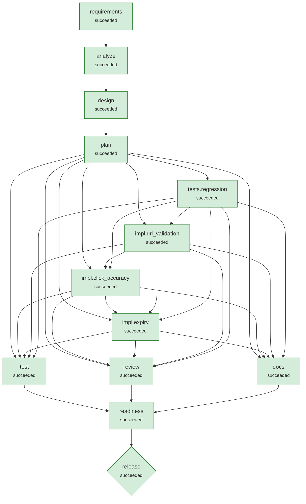

# Run demo-brownfield-sample

**Scenario:** brownfield: linkly v0.4 -> v0.5: security fix, click accuracy fix, link expiry  
**Status:** `succeeded`  
**Provider:** deterministic · **Playbook:** linkly

## 1. Requirement

```text
LINK-142 (security, P1): Pen test found that POST /shorten accepts javascript: and data: URLs, which become stored XSS when the short link is opened. Reject unsafe URLs with 400.
LINK-151 (bug): Marketing reports click counts are under-reported compared with their campaign tool, especially during launches.
LINK-150 (feature): Allow an optional expiry in days when creating a link; expired links must return 410 Gone.
Constraints: existing clients and the production database (v0.4 schema, live data) must keep working.
```

## 2. Requirement understanding

| Capability | Evidence in request | Acceptance criteria |
|---|---|---|
| click_accuracy | LINK-151 (bug): Marketing reports click counts are under-reported compared with their campaign tool, especially during launches. | Concurrent clicks are all counted (atomic increment)<br>Redirects are not permanently cacheable, so repeat clicks reach the service |
| expiry | LINK-150 (feature): Allow an optional expiry in days when creating a link; expired links must return 410 Gone. | Links may carry an optional expiry in the future<br>Expired links return 410 Gone |
| url_safety | LINK-142 (security, P1): Pen test found that POST /shorten accepts javascript: and data: URLs, which become stored XSS when the short link is opened. | Only http(s) targets are accepted; script/data/file schemes are rejected with 400<br>URLs with embedded credentials are rejected |

## 3. Codebase reasoning (brownfield)

- Class dependency graph: `{"com.example.linkly.LinkController":["com.example.linkly.LinkStore"],"com.example.linkly.LinkStore":[],"com.example.linkly.LinklyApplication":[]}`
- Blast radius: ["com.example.linkly.LinkController","com.example.linkly.LinkStore"]
- Data at risk: ["urls"] (schema tables: ["urls"])
- Regression tests selected: ["src/test/java/com/example/linkly/LinkApiTest.java"]

| Capability | Classes | Routes | Tables |
|---|---|---|---|
| click_accuracy | ["com.example.linkly.LinkController","com.example.linkly.LinkStore"] | ["GET /r/{code}"] | ["urls"] |
| expiry | ["com.example.linkly.LinkController","com.example.linkly.LinkStore"] | ["GET /info/{code}","GET /r/{code}"] | ["urls"] |
| url_safety | ["com.example.linkly.LinkController","com.example.linkly.LinkStore"] | ["POST /shorten"] | ["urls"] |

**Latent defects found by static analysis**

- `com.example.linkly.LinkController.go`: cacheable-redirect: 301 is cached by browsers; repeat clicks never reach the server
- `com.example.linkly.LinkStore.create`: enumerable-ids: codes derived from sequential row ids can be enumerated
- `com.example.linkly.LinkStore.hit`: lost-update: reads then writes 'clicks' non-atomically

## 4. Design

Style: layered Spring Boot service: web -> service -> repository (JDBC) -> Flyway-managed schema

| ADR | Decision | Rationale | Alternatives |
|---|---|---|---|
| ADR-01 | Atomic UPDATE ... SET clicks = clicks + 1, and 302 redirects | Fixes lost updates under concurrency and browser-cached 301s that never re-hit the service. | SELECT ... FOR UPDATE row locking (more contention) |
| ADR-02 | Expiry evaluated at read time; 410 Gone | No background job required; expired rows remain for audit and analytics. | Background purge job |
| ADR-03 | Validate targets at the boundary; never fetch them | Blocks script schemes, credential spoofing and internal hosts without network I/O. | Fetch-and-inspect targets (SSRF risk, latency) |

## 5. Plan (v1) and decomposition

| Task | Agent | Depends on | Writes | Verified by | Declared impact |
|---|---|---|---|---|---|
| tests.regression | test_author | - | UrlSafetyTest.java, ClickAccuracyTest.java, ExpiryTest.java, MigrationTest.java | - | low |
| impl.url_validation | implement | tests.regression | UrlValidator.java, LinkController.java | LinkApiTest.java, UrlSafetyTest.java | low |
| impl.click_accuracy | implement | impl.url_validation, tests.regression | LinkStore.java, LinkController.java | ClickAccuracyTest.java, LinkApiTest.java | low |
| impl.expiry | implement | impl.click_accuracy, impl.url_validation, tests.regression | src/main/resources/db/migration/V2__add_expires_at.sql, LinkStore.java, LinkController.java | ExpiryTest.java, LinkApiTest.java, MigrationTest.java | low |

**Traceability (capability → tasks)**

- click_accuracy: ["tests.regression","impl.click_accuracy"]
- expiry: ["tests.regression","impl.expiry"]
- url_safety: ["tests.regression","impl.url_validation"]

## 6. Orchestration graph



Rectangles are stages and tasks; diamonds are high-impact nodes that require human approval.

## 7. Execution

| Node | Kind | Status | Attempts | Runs | Origin | Started | Finished | Note |
|---|---|---|---|---|---|---|---|---|
| requirements | stage | succeeded | 1 | 1 | scenario | 23:10:43 | 23:10:44 |  |
| analyze | stage | succeeded | 1 | 1 | scenario | 23:10:44 | 23:10:44 |  |
| design | stage | succeeded | 1 | 1 | scenario | 23:10:44 | 23:10:44 |  |
| plan | stage | succeeded | 1 | 1 | scenario | 23:10:44 | 23:10:45 |  |
| tests.regression | task | succeeded | 1 | 1 | plan:v1 | 23:10:45 | 23:10:52 |  |
| impl.url_validation | task | succeeded | 1 | 1 | plan:v1 | 23:10:52 | 23:11:08 |  |
| impl.click_accuracy | task | succeeded | 1 | 1 | plan:v1 | 23:11:08 | 23:11:23 |  |
| impl.expiry | task | succeeded | 2 | 1 | plan:v1 | 23:11:23 | 23:12:10 |  |
| docs | stage | succeeded | 1 | 1 | scenario | 23:12:10 | 23:12:45 |  |
| review | stage | succeeded | 1 | 1 | scenario | 23:12:10 | 23:12:45 |  |
| test | stage | succeeded | 1 | 1 | scenario | 23:12:10 | 23:12:45 |  |
| readiness | stage | succeeded | 1 | 1 | scenario | 23:12:45 | 23:12:46 |  |
| release | stage | succeeded | 1 | 1 | scenario | 23:12:46 | 23:13:10 |  |

**Timeline (audit trail excerpts)**

- `23:10:43` **run.session.start**  {"status":"created"}
- `23:10:43` **attempt.start** requirements {"agent":"requirements","attempt":1}
- `23:10:44` **agent.note** requirements {"note":"3 capabilities, 0 ambiguities, 0 blocking"}
- `23:10:44` **attempt.start** analyze {"agent":"codebase","attempt":1}
- `23:10:44` **agent.note** analyze {"note":"blast radius [LinkController, LinkStore], 3 latent defects, regression tests [LinkApiTest]"}
- `23:10:44` **attempt.start** design {"agent":"design","attempt":1}
- `23:10:44` **attempt.start** plan {"agent":"planner","attempt":1}
- `23:10:45` **agent.note** plan {"note":"4 tasks; waiting on []"}
- `23:10:45` **plan.created** plan {"added":["tests.regression","impl.url_validation","impl.click_accuracy","impl.expiry"],"changed":[],"plan_version":1,"removed":[],"reused":[]}
- `23:10:45` **attempt.start** tests.regression {"agent":"test_author","attempt":1}
- `23:10:45` **agent.note** tests.regression {"note":"candidate 1/1: Black-box regression tests for LINK-142/150/151, written before any fix (test-first)"}
- `23:10:45` **change.applied** tests.regression {"added":184,"candidate":0,"digest":"b6764f823187ee20","paths":["src/test/java/com/example/linkly/ClickAccuracyTest.java","src/test/java/com/example/linkly/ExpiryTest.java","src/test/java/com/example/linkly/MigrationTest
- `23:10:52` **attempt.start** impl.url_validation {"agent":"implement","attempt":1}
- `23:10:52` **agent.note** impl.url_validation {"note":"candidate 1/1: LINK-142: reject script/data/credential URLs at the API boundary (new validator)"}
- `23:10:52` **change.applied** impl.url_validation {"added":61,"candidate":0,"digest":"5738251bb575b2f6","paths":["src/main/java/com/example/linkly/LinkController.java","src/main/java/com/example/linkly/UrlValidator.java"],"removed":1,"summary":"LINK-142: reject script/d
- `23:11:08` **attempt.start** impl.click_accuracy {"agent":"implement","attempt":1}
- `23:11:08` **agent.note** impl.click_accuracy {"note":"candidate 1/1: LINK-151: atomic click increment; 302 + no-store so browsers stop caching redirects"}
- `23:11:08` **change.applied** impl.click_accuracy {"added":5,"candidate":0,"digest":"596f0d816e1eb9af","paths":["src/main/java/com/example/linkly/LinkController.java","src/main/java/com/example/linkly/LinkStore.java"],"removed":3,"summary":"LINK-151: atomic click increm
- `23:11:23` **attempt.start** impl.expiry {"agent":"implement","attempt":1}
- `23:11:23` **agent.note** impl.expiry {"note":"candidate 1/2: Add expires_at and backfill existing links with a default 30-day expiry"}
- `23:11:23` **change.applied** impl.expiry {"added":34,"candidate":0,"digest":"d8cd7b434d189a97","paths":["src/main/java/com/example/linkly/LinkController.java","src/main/java/com/example/linkly/LinkStore.java","src/main/resources/db/migration/V2__add_expires_at.
- `23:11:39` **change.rolled_back** impl.expiry {"paths":["src/main/java/com/example/linkly/LinkController.java","src/main/java/com/example/linkly/LinkStore.java","src/main/resources/db/migration/V2__add_expires_at.sql"]}
- `23:11:39` **attempt.retry** impl.expiry {"next_attempt":2,"reason":"build: tests failed: Tests run: 1, Failures: 1, Errors: 0, Skipped: 0, Time elapsed: 1.555 s <<< FAILURE! -- in com.example.linkly.MigrationTest | com.example.linkly.MigrationTest.upgradesAnEx
- `23:11:39` **attempt.start** impl.expiry {"agent":"implement","attempt":2}
- `23:11:39` **agent.note** impl.expiry {"note":"candidate 2/2: Add a nullable expires_at column (V2 migration), so existing rows stay valid (previous attempt failed: build: tests failed: Tests run: 1, Failures: 1, Errors: 0, Skipped: 0, Time elapsed: 1.555 s 
- `23:11:39` **change.applied** impl.expiry {"added":33,"candidate":1,"digest":"823c3370822eba74","paths":["src/main/java/com/example/linkly/LinkController.java","src/main/java/com/example/linkly/LinkStore.java","src/main/resources/db/migration/V2__add_expires_at.
- `23:11:55` **approval.requested** impl.expiry {"reasons":["DATA-001 src/main/resources/db/migration/V2__add_expires_at.sql: schema change against an existing database"],"subject":"823c3370822eba74"}
- `23:11:55` **node.waiting** impl.expiry {"reason":"approval required: DATA-001 src/main/resources/db/migration/V2__add_expires_at.sql: schema change against an existing database"}
- `23:11:55` **run.session.end**  {"status":"waiting","stop_reason":null,"waiting":["impl.expiry"]}
- `23:11:56` **approval.decided** impl.expiry {"by":"reviewer","comment":"additive nullable column; v0.4 upgrade test passes","decided_at":1.791328316627E9,"status":"approved","subject":"823c3370822eba74","waited_s":1.0}
- `23:11:57` **run.session.start**  {"status":"waiting"}
- `23:12:10` **attempt.start** docs {"agent":"docs","attempt":1}
- `23:12:10` **attempt.start** test {"agent":"test_runner","attempt":1}
- `23:12:10` **attempt.start** review {"agent":"reviewer","attempt":1}
- `23:12:15` **agent.note** review {"note":"0 checkstyle, 0 security, 1 latent defects (reported, non-blocking)"}
- `23:12:34` **agent.note** test {"note":"11 passed, 0 failed, line coverage 96.1%"}
- `23:12:45` **change.applied** docs {"added":159,"candidate":0,"digest":"276be5e403379084","paths":["CHANGELOG.md","docs/API.md","docs/DESIGN.md","openapi.json"],"removed":0,"summary":"Generate OpenAPI contract, API reference, design record, changelog"}
- `23:12:45` **attempt.start** readiness {"agent":"release_readiness","attempt":1}
- `23:12:46` **agent.note** readiness {"note":"ready=true, 1 residual risks"}
- `23:12:46` **attempt.start** release {"agent":"release","attempt":1}
- `23:12:46` **change.applied** release {"added":27,"candidate":0,"digest":"679c169b84ecd35e","paths":["RELEASE_NOTES.md","VERSION","pom.xml"],"removed":1,"summary":"Release 0.5.0"}
- `23:12:57` **approval.requested** release {"reasons":["high-impact stage 'release'","CHG-002 pom.xml: modifies a protected file"],"subject":"679c169b84ecd35e"}
- `23:12:57` **node.waiting** release {"reason":"approval required: high-impact stage 'release'; CHG-002 pom.xml: modifies a protected file"}
- `23:12:57` **run.session.end**  {"status":"waiting","stop_reason":null,"waiting":["release"]}
- `23:12:58` **approval.decided** release {"by":"reviewer","comment":"","decided_at":1.791328378464E9,"status":"approved","subject":"679c169b84ecd35e","waited_s":1.3}
- `23:12:59` **run.session.start**  {"status":"waiting"}
- `23:13:10` **run.session.end**  {"status":"succeeded","stop_reason":null,"waiting":[]}

## 8. Validation gates

| Node | Type | Gate | Result | Detail |
|---|---|---|---|---|
| requirements | exit | requirements_valid | pass | 3 capabilities, all with acceptance criteria |
| design | exit | design_covers_requirements | pass | every capability has a design element |
| plan | exit | plan_valid | pass | 4 tasks; every capability traced to at least one task |
| tests.regression | exit | build | pass | compiled, checkstyle clean |
| impl.url_validation | exit | build | pass | compiled, checkstyle clean, [LinkApiTest, UrlSafetyTest] passed |
| impl.click_accuracy | exit | build | pass | compiled, checkstyle clean, [ClickAccuracyTest, LinkApiTest] passed |
| impl.expiry | exit | build | FAIL | tests failed: Tests run: 1, Failures: 1, Errors: 0, Skipped: 0, Time elapsed: 1.555 s <<< FAILURE! -- in com.example.linkly.MigrationTest \| com.exampl |
| impl.expiry | exit | build | pass | compiled, checkstyle clean, [ExpiryTest, LinkApiTest, MigrationTest] passed |
| impl.expiry | exit | build | pass | compiled, checkstyle clean, [ExpiryTest, LinkApiTest, MigrationTest] passed |
| review | exit | lint_clean | pass | no checkstyle violations |
| review | exit | security_clean | pass | no security findings |
| test | exit | tests_pass | pass | 11 passed, 0 failed, 0 errors |
| test | exit | coverage_min | pass | line coverage 96.1% (min 85.0%) |
| docs | exit | openapi_valid | pass | 3 operations; all designed endpoints present |
| docs | exit | docs_complete | pass | 4 docs written |
| readiness | exit | readiness | pass | all release checks pass |
| release | exit | smoke | pass | packaged JAR started; POST /shorten -> 200; GET /r/1 -> 302; POST /shorten -> 400; GET /info/1 -> 200 |
| release | exit | smoke | pass | packaged JAR started; POST /shorten -> 200; GET /r/2 -> 302; POST /shorten -> 400; GET /info/2 -> 200 |

## 9. Policy guardrails

| Node | Rule | Severity | Path | Message |
|---|---|---|---|---|
| impl.expiry | DATA-001 | approve | src/main/resources/db/migration/V2__add_expires_at.sql | schema change against an existing database |
| impl.expiry | DATA-001 | approve | src/main/resources/db/migration/V2__add_expires_at.sql | schema change against an existing database |
| release | CHG-002 | approve | pom.xml | modifies a protected file |

## 10. Human approvals

| Node | Subject | Reasons | Decision | By | Waited (s) |
|---|---|---|---|---|---|
| impl.expiry | 823c3370822eba74 | DATA-001 src/main/resources/db/migration/V2__add_expires_at.sql: schema change against an existing database | approved | reviewer | 1.0 |
| release | 679c169b84ecd35e | high-impact stage 'release'<br>CHG-002 pom.xml: modifies a protected file | approved | reviewer | 1.3 |

## 11. Decision log (lineage)

| Id | Node | By | Decision | Rationale | Inputs |
|---|---|---|---|---|---|
| D001 | analyze | agent | Sequential/enumerable codes noted but left out of scope | Changing code generation alters every future URL format and is not requested by the tickets; raised as a follow-up risk instead. | {requirements=1} |
| D002 | design | agent | Atomic UPDATE ... SET clicks = clicks + 1, and 302 redirects | Fixes lost updates under concurrency and browser-cached 301s that never re-hit the service. | {impact_analysis=1, requirements=1} |
| D003 | design | agent | Expiry evaluated at read time; 410 Gone | No background job required; expired rows remain for audit and analytics. | {impact_analysis=1, requirements=1} |
| D004 | design | agent | Validate targets at the boundary; never fetch them | Blocks script schemes, credential spoofing and internal hosts without network I/O. | {impact_analysis=1, requirements=1} |
| D005 | plan | agent | Serialise impl.click_accuracy after impl.url_validation | Both change [LinkController.java]; running them in parallel could produce conflicting edits, so they are ordered like a merge queue. | {design=1, impact_analysis=1, requirements=1} |

### test_report

```json
{
  "coverage" : 96.1,
  "errors" : 0,
  "failed" : 0,
  "failures" : [ ],
  "ok" : true,
  "passed" : 11,
  "skipped" : 0,
  "total" : 11
}
```

### review_report

```json
{
  "latent_defects" : [ {
    "detail" : "codes derived from sequential row ids can be enumerated",
    "function" : "create",
    "kind" : "enumerable-ids",
    "module" : "com.example.linkly.LinkStore"
  } ],
  "lint" : [ ],
  "security" : [ ]
}
```

### release_readiness

```json
{
  "checks" : [ {
    "check" : "all tests pass",
    "detail" : "11 passed / 0 failed",
    "passed" : true
  }, {
    "check" : "line coverage >= 85.0%",
    "detail" : "96.1%",
    "passed" : true
  }, {
    "check" : "checkstyle clean",
    "detail" : "0 issues",
    "passed" : true
  }, {
    "check" : "no security findings",
    "detail" : "0 findings",
    "passed" : true
  }, {
    "check" : "docs generated",
    "detail" : "openapi.json, docs/API.md, docs/DESIGN.md, CHANGELOG.md",
    "passed" : true
  }, {
    "check" : "no blocking questions open",
    "detail" : "[]",
    "passed" : true
  } ],
  "ready" : true,
  "residual_risks" : [ "LinkStore.create: codes derived from sequential row ids can be enumerated" ]
}
```

## 12. Artifact lineage

Provenance of `release`:

- release v1 ← release
  - plan v1 ← plan
    - design v1 ← design
      - impact_analysis v1 ← analyze
        - requirements v1 ← requirements
          - human_answers v1 ← scenario
          - requirement_text v1 ← scenario
  - release_readiness v1 ← readiness
    - docs v1 ← docs
    - review_report v1 ← review
    - test_report v1 ← test

## 13. Reliability metrics

| Metric | Value |
|---|---|
| nodes_succeeded | 13 |
| nodes_failed | 0 |
| node_success_rate | 1.0 |
| attempts | 12 |
| attempt_success_rate | 0.917 |
| retries | 1 |
| changes_applied | 7 |
| rollbacks | 1 |
| rollback_rate | 0.143 |
| mttr_s | 16.092 |
| recoveries | 1 |
| replans | 0 |
| invalidations | 0 |
| reused_nodes | 0 |
| policy_blocks | 0 |
| approvals | 2 |
| approval_wait_s | 1.2 |
| active_time_s | 143.08 |
| wall_time_s | 146.753 |
| sessions | 3 |
| llm_tokens | 0 |

Audit chain: **verified** (102 records, chain intact).

## 14. Change sets

Every applied change (including rolled-back attempts) is kept in `changes/`:

- `changes/docs.a1.diff`
- `changes/impl.click_accuracy.a1.diff`
- `changes/impl.expiry.a1.diff`
- `changes/impl.expiry.a2.diff`
- `changes/impl.url_validation.a1.diff`
- `changes/release.a1.diff`
- `changes/tests.regression.a1.diff`
