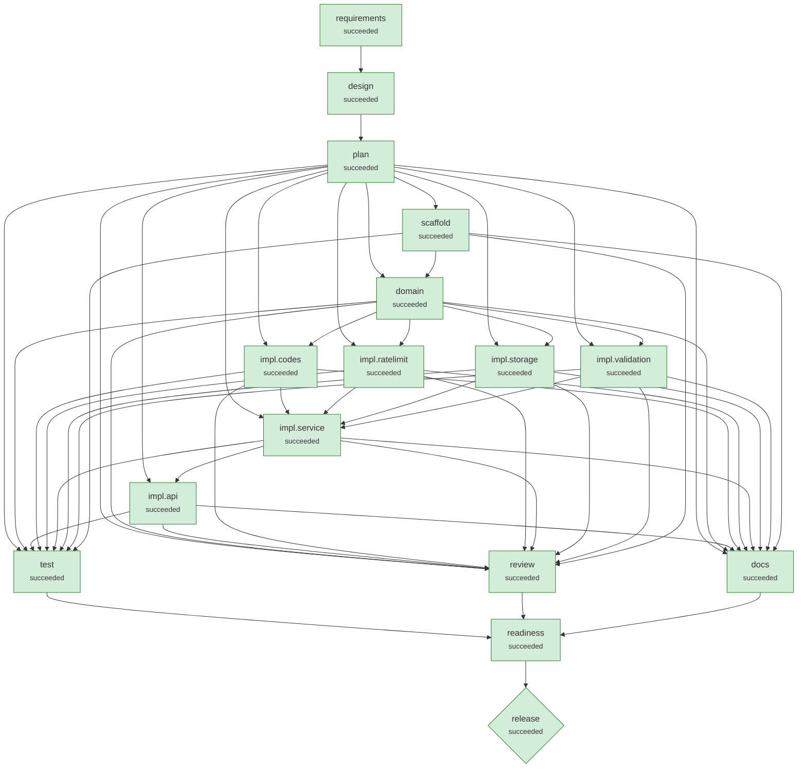

# Run demo-greenfield-sample

**Scenario:** greenfield: URL shortener service, from scratch  
**Status:** `succeeded`  
**Provider:** deterministic · **Playbook:** shortener

## 1. Requirement

```text
Build a URL shortener service with a versioned REST API.
Authenticated clients (API key) can create short links for http/https URLs, optionally with a custom alias and an expiry time.
Visiting a short link must redirect to the target; unknown links return 404 and deleted or expired links return 410.
Owners can view link details, delete links and see click analytics: total clicks, clicks per day and top referrer hosts.
Store no IP addresses or other personal data for analytics.
Reject unsafe targets such as javascript: URLs, embedded credentials and internal hosts.
Rate limit link creation per API key (60 per minute) and make creation safe to retry with an idempotency key.
Expose health and readiness endpoints and propagate a request id on every response.
```

## 2. Requirement understanding

| Capability | Evidence in request | Acceptance criteria |
|---|---|---|
| analytics | Owners can view link details, delete links and see click analytics: total clicks, clicks per day and top referrer hosts. | Per-link total clicks, daily breakdown and top referrer hosts<br>Click recording never delays the redirect response |
| custom_alias | Authenticated clients (API key) can create short links for http/https URLs, optionally with a custom alias and an expiry time. | Aliases are 3-32 chars [A-Za-z0-9_-] and cannot shadow service routes<br>A taken alias returns 409 |
| expiry | Authenticated clients (API key) can create short links for http/https URLs, optionally with a custom alias and an expiry time. | Links may carry an optional expiry in the future<br>Expired links return 410 Gone |
| link_creation | Build a URL shortener service with a versioned REST API. | POST /api/v1/links returns 201 with code and short_url<br>Generated codes are random base62, not sequential or enumerable<br>Code collisions are retried transparently |
| rate_limiting | Rate limit link creation per API key (60 per minute) and make creation safe to retry with an idempotency key. | Link creation is limited per API key; excess returns 429 + Retry-After |
| redirect | Visiting a short link must redirect to the target; unknown links return 404 and deleted or expired links return 410. | GET /{code} returns 302 to the target<br>Unknown codes return 404; deleted or expired codes return 410 |
| reliability | Rate limit link creation per API key (60 per minute) and make creation safe to retry with an idempotency key. | Create is safe to retry with Idempotency-Key<br>/healthz (liveness) and /readyz (database check)<br>Every response carries X-Request-ID |
| url_safety | Reject unsafe targets such as javascript: URLs, embedded credentials and internal hosts. | Only http(s) targets are accepted; script/data/file schemes are rejected with 400<br>URLs with embedded credentials are rejected |

**Requirement coverage** (every clause of the request has a disposition)

| Clause | Text | Disposition | Covered by |
|---|---|---|---|
| C1 | Build a URL shortener service with a versioned REST API. | supported | link_creation |
| C2 | Authenticated clients (API key) can create short links for http/https URLs, optionally with a custom alias and an expiry time. | supported | custom_alias, expiry, link_creation |
| C3 | Visiting a short link must redirect to the target | supported | link_creation, redirect |
| C4 | unknown links return 404 and deleted or expired links return 410. | supported | expiry |
| C5 | Owners can view link details, delete links and see click analytics: total clicks, clicks per day and top referrer hosts. | supported | analytics |
| C6 | Store no IP addresses or other personal data for analytics. | supported | analytics |
| C7 | Reject unsafe targets such as javascript: URLs, embedded credentials and internal hosts. | supported | url_safety |
| C8 | Rate limit link creation per API key (60 per minute) and make creation safe to retry with an idempotency key. | supported | rate_limiting, reliability |
| C9 | Expose health and readiness endpoints and propagate a request id on every response. | supported | reliability |

## 4. Design

Style: layered Spring Boot service: web -> service -> repository (JDBC) -> Flyway-managed schema

| ADR | Decision | Rationale | Alternatives |
|---|---|---|---|
| ADR-01 | Record clicks off the request thread; store referrer host + user-agent family only | Keeps redirect latency independent of analytics writes and minimises personal data. | Synchronous write (simpler, slower); Event queue such as Kafka (scales, more infrastructure) |
| ADR-02 | Expiry evaluated at read time; 410 Gone | No background job required; expired rows remain for audit and analytics. | Background purge job |
| ADR-03 | Random base62 codes (7 chars, SecureRandom) with collision retry | 62^7 ≈ 3.5e12 codes; random codes cannot be enumerated, unlike sequential ids. | Sequential id + base62 (enumerable); Hash of the URL (dedups, but leaks equality) |
| ADR-04 | In-process token bucket keyed by API-key owner | Zero infrastructure for a single instance; swap for Redis or the API gateway when scaled out. | Redis sliding window (multi-instance); API gateway limits |
| ADR-05 | 302 + Cache-Control: no-store for redirects | Every click must reach the service for analytics; 301 is cached by browsers. | 301 Moved Permanently (cheaper, but under-counts) |
| ADR-06 | Spring JDBC + Flyway on H2 for the prototype, behind a repository class | Zero-ops, transactional and migration-managed; the JDBC URL switches it to PostgreSQL. | PostgreSQL now (more ops for a prototype); JPA/Hibernate (more abstraction than needed) |
| ADR-07 | Validate targets at the boundary; never fetch them | Blocks script schemes, credential spoofing and internal hosts without network I/O. | Fetch-and-inspect targets (SSRF risk, latency) |

## 5. Plan (v1) and decomposition

| Task | Agent | Depends on | Writes | Verified by | Declared impact |
|---|---|---|---|---|---|
| scaffold | implement | - | pom.xml, checkstyle.xml, src/main/resources/application.properties, ShortenerApplication.java, ShortenerProperties.java | - | low |
| domain | implement | scaffold | Link.java, Click.java, LinkStats.java, Errors.java | - | low |
| impl.codes | implement | domain | CodeGenerator.java, CodeGeneratorTest.java | CodeGeneratorTest.java | low |
| impl.validation | implement | domain | UrlValidator.java, UrlValidatorTest.java | UrlValidatorTest.java | low |
| impl.ratelimit | implement | domain | TokenBucketRateLimiter.java, AppConfig.java, TokenBucketRateLimiterTest.java | TokenBucketRateLimiterTest.java | low |
| impl.storage | implement | domain | src/main/resources/db/migration/V1__init.sql, LinkRepository.java | - | low |
| impl.service | implement | impl.codes, impl.ratelimit, impl.storage, impl.validation | LinkService.java, MutableClock.java, TestClockConfig.java, IntegrationTest.java, Http.java, LinkServiceTest.java | LinkServiceTest.java | low |
| impl.api | implement | impl.service | Dtos.java, ApiKeyAuth.java, LinkController.java, RedirectController.java, HealthController.java, ApiExceptionHandler.java, RequestIdFilter.java, src/main/resources/static/index.html, ApiIntegrationTest.java, OpenApiExportTest.java, ClickRecordingTest.java | ApiIntegrationTest.java, OpenApiExportTest.java, ClickRecordingTest.java | low |

**Traceability (capability → tasks)**

- analytics: ["domain","impl.storage","impl.service","impl.api"]
- custom_alias: ["impl.codes","impl.service"]
- expiry: ["impl.storage","impl.service"]
- link_creation: ["domain","impl.codes","impl.storage","impl.service","impl.api"]
- rate_limiting: ["impl.ratelimit","impl.api"]
- redirect: ["impl.api"]
- reliability: ["domain","impl.service","impl.api"]
- url_safety: ["impl.validation"]

## 6. Orchestration graph



Rectangles are stages and tasks; diamonds are high-impact nodes that require human approval.

## 7. Execution

| Node | Kind | Status | Attempts | Runs | Origin | Started | Finished | Note |
|---|---|---|---|---|---|---|---|---|
| requirements | stage | succeeded | 1 | 1 | scenario | 02:35:29 | 02:35:30 |  |
| design | stage | succeeded | 1 | 1 | scenario | 02:35:30 | 02:35:30 |  |
| plan | stage | succeeded | 1 | 1 | scenario | 02:35:30 | 02:35:30 |  |
| scaffold | task | succeeded | 1 | 1 | plan:v1 | 02:35:30 | 02:35:36 |  |
| domain | task | succeeded | 1 | 1 | plan:v1 | 02:35:36 | 02:35:42 |  |
| impl.codes | task | succeeded | 1 | 1 | plan:v1 | 02:35:42 | 02:35:50 |  |
| impl.ratelimit | task | succeeded | 1 | 1 | plan:v1 | 02:35:42 | 02:35:57 |  |
| impl.storage | task | succeeded | 1 | 1 | plan:v1 | 02:35:42 | 02:36:04 |  |
| impl.validation | task | succeeded | 1 | 1 | plan:v1 | 02:35:42 | 02:36:12 |  |
| impl.service | task | succeeded | 1 | 1 | plan:v1 | 02:36:12 | 02:36:25 |  |
| impl.api | task | succeeded | 1 | 1 | plan:v1 | 02:36:25 | 02:36:41 |  |
| docs | stage | succeeded | 1 | 1 | scenario | 02:36:41 | 02:37:14 |  |
| review | stage | succeeded | 1 | 1 | scenario | 02:36:41 | 02:37:15 |  |
| test | stage | succeeded | 1 | 1 | scenario | 02:36:41 | 02:37:14 |  |
| readiness | stage | succeeded | 1 | 1 | scenario | 02:37:15 | 02:37:15 |  |
| release | stage | succeeded | 1 | 1 | scenario | 02:37:15 | 02:37:37 |  |

**Timeline (audit trail excerpts)**

- `02:35:29` **run.session.start**  {"fencing":1,"owner":"host-3da02335:541265:53223751","sandbox":"bwrap (fs + env + network isolation)","status":"created"}
- `02:35:29` **attempt.start** requirements {"agent":"requirements","attempt":1}
- `02:35:30` **agent.note** requirements {"note":"8 capabilities, 0 ambiguities, 0 blocking"}
- `02:35:30` **attempt.start** design {"agent":"design","attempt":1}
- `02:35:30` **attempt.start** plan {"agent":"planner","attempt":1}
- `02:35:30` **agent.note** plan {"note":"8 tasks; waiting on []"}
- `02:35:30` **plan.created** plan {"added":["scaffold","domain","impl.codes","impl.validation","impl.ratelimit","impl.storage","impl.service","impl.api"],"changed":[],"plan_version":1,"removed":[],"reused":[]}
- `02:35:30` **attempt.start** scaffold {"agent":"implement","attempt":1}
- `02:35:30` **agent.note** scaffold {"note":"candidate 1/1: Maven project, configuration properties and application entry point"}
- `02:35:31` **change.applied** scaffold {"added":182,"candidate":0,"digest":"c56bec578753431e","paths":["checkstyle.xml","pom.xml","src/main/java/com/example/shortener/ShortenerApplication.java","src/main/java/com/example/shortener/config/ShortenerProperties.j
- `02:35:36` **attempt.start** domain {"agent":"implement","attempt":1}
- `02:35:36` **agent.note** domain {"note":"candidate 1/1: Domain model: links, clicks, stats and API error types"}
- `02:35:36` **change.applied** domain {"added":124,"candidate":0,"digest":"3a460222be7c2b19","paths":["src/main/java/com/example/shortener/domain/Click.java","src/main/java/com/example/shortener/domain/Errors.java","src/main/java/com/example/shortener/domain
- `02:35:42` **attempt.start** impl.codes {"agent":"implement","attempt":1}
- `02:35:42` **attempt.start** impl.ratelimit {"agent":"implement","attempt":1}
- `02:35:42` **attempt.start** impl.storage {"agent":"implement","attempt":1}
- `02:35:42` **attempt.start** impl.validation {"agent":"implement","attempt":1}
- `02:35:42` **agent.note** impl.codes {"note":"candidate 1/1: Random base62 code generator and custom-alias rules (with unit tests)"}
- `02:35:42` **agent.note** impl.ratelimit {"note":"candidate 1/1: Token-bucket rate limiter with bounded memory; clock and click executor beans"}
- `02:35:42` **agent.note** impl.storage {"note":"candidate 1/1: Flyway schema and JDBC repository for links and click events"}
- `02:35:42` **agent.note** impl.validation {"note":"candidate 1/1: Target-URL validation: scheme allowlist, credentials, private hosts, loops"}
- `02:35:42` **change.applied** impl.codes {"added":90,"candidate":0,"digest":"c7036598e48a3500","paths":["src/main/java/com/example/shortener/service/CodeGenerator.java","src/test/java/com/example/shortener/unit/CodeGeneratorTest.java"],"removed":0,"summary":"Ra
- `02:35:50` **change.applied** impl.ratelimit {"added":124,"candidate":0,"digest":"cbfa7a784df7fc84","paths":["src/main/java/com/example/shortener/config/AppConfig.java","src/main/java/com/example/shortener/service/TokenBucketRateLimiter.java","src/test/java/com/exa
- `02:35:57` **change.applied** impl.storage {"added":141,"candidate":0,"digest":"938dee471f776120","paths":["src/main/java/com/example/shortener/service/LinkRepository.java","src/main/resources/db/migration/V1__init.sql"],"removed":0,"summary":"Flyway schema and J
- `02:36:04` **change.applied** impl.validation {"added":151,"candidate":0,"digest":"f9038c0847192940","paths":["src/main/java/com/example/shortener/service/UrlValidator.java","src/test/java/com/example/shortener/unit/UrlValidatorTest.java"],"removed":0,"summary":"Tar
- `02:36:12` **attempt.start** impl.service {"agent":"implement","attempt":1}
- `02:36:12` **agent.note** impl.service {"note":"candidate 1/1: Link service: create/resolve/delete/stats, idempotency, expiry, ownership"}
- `02:36:12` **change.applied** impl.service {"added":386,"candidate":0,"digest":"af5c78f9e29b4577","paths":["src/main/java/com/example/shortener/service/LinkService.java","src/test/java/com/example/shortener/integration/LinkServiceTest.java","src/test/java/com/exa
- `02:36:25` **attempt.start** impl.api {"agent":"implement","attempt":1}
- `02:36:25` **agent.note** impl.api {"note":"candidate 1/1: HTTP API: auth, error mapping, request ids, health/readiness, home page"}
- `02:36:25` **change.applied** impl.api {"added":680,"candidate":0,"digest":"28ed95934d3b8eac","paths":["src/main/java/com/example/shortener/web/ApiExceptionHandler.java","src/main/java/com/example/shortener/web/ApiKeyAuth.java","src/main/java/com/example/shor
- `02:36:41` **attempt.start** docs {"agent":"docs","attempt":1}
- `02:36:41` **attempt.start** test {"agent":"test_runner","attempt":1}
- `02:36:41` **attempt.start** review {"agent":"reviewer","attempt":1}
- `02:37:10` **agent.note** test {"note":"61 passed, 0 failed, line coverage 93.2%"}
- `02:37:14` **change.applied** docs {"added":474,"candidate":0,"digest":"efd264906440b7bc","paths":["CHANGELOG.md","README.md","docs/API.md","docs/DESIGN.md","openapi.json"],"removed":0,"summary":"Generate OpenAPI contract, API reference, design record, ch
- `02:37:15` **agent.note** review {"note":"0 checkstyle, 0 security, 0 latent defects (reported, non-blocking)"}
- `02:37:15` **attempt.start** readiness {"agent":"release_readiness","attempt":1}
- `02:37:15` **agent.note** readiness {"note":"ready=true, 0 residual risks"}
- `02:37:15` **attempt.start** release {"agent":"release","attempt":1}
- `02:37:15` **change.applied** release {"added":28,"candidate":0,"digest":"b8b796082ba4ddd1","paths":["RELEASE_NOTES.md","VERSION"],"removed":0,"summary":"Release 1.0.0"}
- `02:37:25` **approval.requested** release {"evidence":{"change_set":"b8b796082ba4ddd1","docs":"556739c44f59b720@v1","gates":["smoke=pass"],"plan":"b613cdf9ad6c2a99@v1","policy_findings":"4f53cda18c2baa0c","release_readiness":"d58982ba418a4c8e@v1","requirements":
- `02:37:25` **node.waiting** release {"reason":"approval required: high-impact stage 'release'"}
- `02:37:25` **run.session.end**  {"status":"waiting","stop_reason":null,"waiting":["release"]}
- `02:37:26` **approval.decided** release {"authenticated":"token","by":"reviewer","comment":"release evidence reviewed","decided_at":1.791340646486E9,"role":"release","status":"approved","subject":"da2584aa8bad7af0","waited_s":1.1}
- `02:37:27` **run.session.start**  {"fencing":2,"owner":"host-3da02335:544544:513f1198","sandbox":"bwrap (fs + env + network isolation)","status":"waiting"}
- `02:37:37` **run.session.end**  {"status":"succeeded","stop_reason":null,"waiting":[]}

## 8. Validation gates

| Node | Type | Gate | Result | Detail |
|---|---|---|---|---|
| requirements | exit | requirements_valid | pass | 8 capabilities, all with acceptance criteria |
| design | exit | design_covers_requirements | pass | every capability has a design element |
| plan | exit | plan_valid | pass | 8 tasks; every capability traced to at least one task |
| scaffold | exit | build | pass | compiled, checkstyle clean; sandbox bwrap |
| domain | exit | build | pass | compiled, checkstyle clean; sandbox bwrap |
| impl.codes | exit | build | pass | compiled, checkstyle clean, executed: CodeGeneratorTest 13/13; sandbox bwrap |
| impl.ratelimit | exit | build | pass | compiled, checkstyle clean, executed: TokenBucketRateLimiterTest 3/3; sandbox bwrap |
| impl.storage | exit | build | pass | compiled, checkstyle clean; sandbox bwrap |
| impl.validation | exit | build | pass | compiled, checkstyle clean, executed: UrlValidatorTest 22/22; sandbox bwrap |
| impl.service | exit | build | pass | compiled, checkstyle clean, executed: LinkServiceTest 7/7; sandbox bwrap |
| impl.api | exit | build | pass | compiled, checkstyle clean, executed: ApiIntegrationTest 14/14, OpenApiExportTest 1/1, ClickRecordingTest 1/1; sandbox bwrap |
| docs | exit | openapi_valid | pass | 7 operations; all designed endpoints present |
| docs | exit | docs_complete | pass | 5 docs written |
| test | exit | tests_pass | pass | 61 passed, 0 failed, 0 errors |
| test | exit | coverage_min | pass | line coverage 93.2% (min 90.0%) |
| review | exit | lint_clean | pass | no checkstyle violations |
| review | exit | security_clean | pass | no security findings |
| readiness | exit | readiness | pass | all release checks pass |
| release | exit | smoke | pass | packaged JAR started; GET /healthz -> 200; GET /readyz -> 200; POST /api/v1/links -> 201; GET /3mGJj3o -> 302; GET /api/v1/links/3mGJj3o/stats -> 200 |
| release | exit | smoke | pass | packaged JAR started; GET /healthz -> 200; GET /readyz -> 200; POST /api/v1/links -> 201; GET /s8Mfiyg -> 302; GET /api/v1/links/s8Mfiyg/stats -> 200 |

## 9. Policy guardrails

No policy findings on any change set.

## 10. Human approvals

| Node | Subject | Reasons | Decision | By | Waited (s) |
|---|---|---|---|---|---|
| release | da2584aa8bad7af0 | high-impact stage 'release' | approved | reviewer | 1.1 |

## 11. Decision log (lineage)

| Id | Node | By | Decision | Rationale | Inputs |
|---|---|---|---|---|---|
| D001 | design | agent | Record clicks off the request thread; store referrer host + user-agent family only | Keeps redirect latency independent of analytics writes and minimises personal data. | {requirements=1} |
| D002 | design | agent | Expiry evaluated at read time; 410 Gone | No background job required; expired rows remain for audit and analytics. | {requirements=1} |
| D003 | design | agent | Random base62 codes (7 chars, SecureRandom) with collision retry | 62^7 ≈ 3.5e12 codes; random codes cannot be enumerated, unlike sequential ids. | {requirements=1} |
| D004 | design | agent | In-process token bucket keyed by API-key owner | Zero infrastructure for a single instance; swap for Redis or the API gateway when scaled out. | {requirements=1} |
| D005 | design | agent | 302 + Cache-Control: no-store for redirects | Every click must reach the service for analytics; 301 is cached by browsers. | {requirements=1} |
| D006 | design | agent | Spring JDBC + Flyway on H2 for the prototype, behind a repository class | Zero-ops, transactional and migration-managed; the JDBC URL switches it to PostgreSQL. | {requirements=1} |
| D007 | design | agent | Validate targets at the boundary; never fetch them | Blocks script schemes, credential spoofing and internal hosts without network I/O. | {requirements=1} |

### Feature-completion proof (criterion → code → test)

| Criterion | Text | Code | Passing tests | Status |
|---|---|---|---|---|
| AC-analytics-1 | Per-link total clicks, daily breakdown and top referrer hosts | src/main/java/com/example/shortener/domain/Click.java<br>src/main/java/com/example/shortener/domain/Errors.java<br>src/main/java/com/example/shortener/domain/Link.java<br>src/main/java/com/example/shortener/domain/LinkStats.java<br>src/main/java/com/example/shortener/service/LinkRepository.java<br>src/main/java/com/example/shortener/service/LinkService.java<br>src/main/java/com/example/shortener/web/ApiExceptionHandler.java<br>src/main/java/com/example/shortener/web/ApiKeyAuth.java<br>src/main/java/com/example/shortener/web/Dtos.java<br>src/main/java/com/example/shortener/web/HealthController.java<br>src/main/java/com/example/shortener/web/LinkController.java<br>src/main/java/com/example/shortener/web/RedirectController.java<br>src/main/java/com/example/shortener/web/RequestIdFilter.java<br>src/main/resources/db/migration/V1__init.sql<br>src/main/resources/static/index.html | ApiIntegrationTest.createRedirectAndStatsFlow | proven |
| AC-analytics-2 | Click recording never delays the redirect response | src/main/java/com/example/shortener/domain/Click.java<br>src/main/java/com/example/shortener/domain/Errors.java<br>src/main/java/com/example/shortener/domain/Link.java<br>src/main/java/com/example/shortener/domain/LinkStats.java<br>src/main/java/com/example/shortener/service/LinkRepository.java<br>src/main/java/com/example/shortener/service/LinkService.java<br>src/main/java/com/example/shortener/web/ApiExceptionHandler.java<br>src/main/java/com/example/shortener/web/ApiKeyAuth.java<br>src/main/java/com/example/shortener/web/Dtos.java<br>src/main/java/com/example/shortener/web/HealthController.java<br>src/main/java/com/example/shortener/web/LinkController.java<br>src/main/java/com/example/shortener/web/RedirectController.java<br>src/main/java/com/example/shortener/web/RequestIdFilter.java<br>src/main/resources/db/migration/V1__init.sql<br>src/main/resources/static/index.html | ClickRecordingTest.theRedirectIsAnsweredBeforeTheClickIsRecorded | proven |
| AC-custom_alias-1 | Aliases are 3-32 chars [A-Za-z0-9_-] and cannot shadow service routes | src/main/java/com/example/shortener/service/CodeGenerator.java<br>src/main/java/com/example/shortener/service/LinkService.java | CodeGeneratorTest.acceptsValidAliases | proven |
| AC-custom_alias-2 | A taken alias returns 409 | src/main/java/com/example/shortener/service/CodeGenerator.java<br>src/main/java/com/example/shortener/service/LinkService.java | ApiIntegrationTest.customAliasAndConflict<br>LinkServiceTest.aliasConflict | proven |
| AC-expiry-1 | Links may carry an optional expiry in the future | src/main/java/com/example/shortener/service/LinkRepository.java<br>src/main/java/com/example/shortener/service/LinkService.java<br>src/main/resources/db/migration/V1__init.sql | LinkServiceTest.expiryMustBeFutureAndIsEnforced | proven |
| AC-expiry-2 | Expired links return 410 Gone | src/main/java/com/example/shortener/service/LinkRepository.java<br>src/main/java/com/example/shortener/service/LinkService.java<br>src/main/resources/db/migration/V1__init.sql | ApiIntegrationTest.expiredLinkReturnsGone<br>LinkServiceTest.expiryMustBeFutureAndIsEnforced | proven |
| AC-link_creation-1 | POST /api/v1/links returns 201 with code and short_url | src/main/java/com/example/shortener/domain/Click.java<br>src/main/java/com/example/shortener/domain/Errors.java<br>src/main/java/com/example/shortener/domain/Link.java<br>src/main/java/com/example/shortener/domain/LinkStats.java<br>src/main/java/com/example/shortener/service/CodeGenerator.java<br>src/main/java/com/example/shortener/service/LinkRepository.java<br>src/main/java/com/example/shortener/service/LinkService.java<br>src/main/java/com/example/shortener/web/ApiExceptionHandler.java<br>src/main/java/com/example/shortener/web/ApiKeyAuth.java<br>src/main/java/com/example/shortener/web/Dtos.java<br>src/main/java/com/example/shortener/web/HealthController.java<br>src/main/java/com/example/shortener/web/LinkController.java<br>src/main/java/com/example/shortener/web/RedirectController.java<br>src/main/java/com/example/shortener/web/RequestIdFilter.java<br>src/main/resources/db/migration/V1__init.sql<br>src/main/resources/static/index.html | ApiIntegrationTest.createRedirectAndStatsFlow<br>LinkServiceTest.createAndResolve | proven |
| AC-link_creation-2 | Generated codes are random base62, not sequential or enumerable | src/main/java/com/example/shortener/domain/Click.java<br>src/main/java/com/example/shortener/domain/Errors.java<br>src/main/java/com/example/shortener/domain/Link.java<br>src/main/java/com/example/shortener/domain/LinkStats.java<br>src/main/java/com/example/shortener/service/CodeGenerator.java<br>src/main/java/com/example/shortener/service/LinkRepository.java<br>src/main/java/com/example/shortener/service/LinkService.java<br>src/main/java/com/example/shortener/web/ApiExceptionHandler.java<br>src/main/java/com/example/shortener/web/ApiKeyAuth.java<br>src/main/java/com/example/shortener/web/Dtos.java<br>src/main/java/com/example/shortener/web/HealthController.java<br>src/main/java/com/example/shortener/web/LinkController.java<br>src/main/java/com/example/shortener/web/RedirectController.java<br>src/main/java/com/example/shortener/web/RequestIdFilter.java<br>src/main/resources/db/migration/V1__init.sql<br>src/main/resources/static/index.html | CodeGeneratorTest.codesAreNotSequential<br>CodeGeneratorTest.generatesBase62CodesOfTheRequestedLength | proven |
| AC-link_creation-3 | Code collisions are retried transparently | src/main/java/com/example/shortener/domain/Click.java<br>src/main/java/com/example/shortener/domain/Errors.java<br>src/main/java/com/example/shortener/domain/Link.java<br>src/main/java/com/example/shortener/domain/LinkStats.java<br>src/main/java/com/example/shortener/service/CodeGenerator.java<br>src/main/java/com/example/shortener/service/LinkRepository.java<br>src/main/java/com/example/shortener/service/LinkService.java<br>src/main/java/com/example/shortener/web/ApiExceptionHandler.java<br>src/main/java/com/example/shortener/web/ApiKeyAuth.java<br>src/main/java/com/example/shortener/web/Dtos.java<br>src/main/java/com/example/shortener/web/HealthController.java<br>src/main/java/com/example/shortener/web/LinkController.java<br>src/main/java/com/example/shortener/web/RedirectController.java<br>src/main/java/com/example/shortener/web/RequestIdFilter.java<br>src/main/resources/db/migration/V1__init.sql<br>src/main/resources/static/index.html | LinkServiceTest.codeCollisionsAreRetriedTransparently | proven |
| AC-rate_limiting-1 | Link creation is limited per API key; excess returns 429 + Retry-After | src/main/java/com/example/shortener/config/AppConfig.java<br>src/main/java/com/example/shortener/service/TokenBucketRateLimiter.java<br>src/main/java/com/example/shortener/web/ApiExceptionHandler.java<br>src/main/java/com/example/shortener/web/ApiKeyAuth.java<br>src/main/java/com/example/shortener/web/Dtos.java<br>src/main/java/com/example/shortener/web/HealthController.java<br>src/main/java/com/example/shortener/web/LinkController.java<br>src/main/java/com/example/shortener/web/RedirectController.java<br>src/main/java/com/example/shortener/web/RequestIdFilter.java<br>src/main/resources/static/index.html | ApiIntegrationTest.rateLimitReturns429WithRetryAfter<br>TokenBucketRateLimiterTest.allowsBurstThenLimitsAndRefills | proven |
| AC-redirect-1 | GET /{code} returns 302 to the target | src/main/java/com/example/shortener/web/ApiExceptionHandler.java<br>src/main/java/com/example/shortener/web/ApiKeyAuth.java<br>src/main/java/com/example/shortener/web/Dtos.java<br>src/main/java/com/example/shortener/web/HealthController.java<br>src/main/java/com/example/shortener/web/LinkController.java<br>src/main/java/com/example/shortener/web/RedirectController.java<br>src/main/java/com/example/shortener/web/RequestIdFilter.java<br>src/main/resources/static/index.html | ApiIntegrationTest.createRedirectAndStatsFlow | proven |
| AC-redirect-2 | Unknown codes return 404; deleted or expired codes return 410 | src/main/java/com/example/shortener/web/ApiExceptionHandler.java<br>src/main/java/com/example/shortener/web/ApiKeyAuth.java<br>src/main/java/com/example/shortener/web/Dtos.java<br>src/main/java/com/example/shortener/web/HealthController.java<br>src/main/java/com/example/shortener/web/LinkController.java<br>src/main/java/com/example/shortener/web/RedirectController.java<br>src/main/java/com/example/shortener/web/RequestIdFilter.java<br>src/main/resources/static/index.html | ApiIntegrationTest.deleteMakesLinkGone<br>ApiIntegrationTest.expiredLinkReturnsGone<br>ApiIntegrationTest.unknownCodeIs404 | proven |
| AC-reliability-1 | Create is safe to retry with Idempotency-Key | src/main/java/com/example/shortener/domain/Click.java<br>src/main/java/com/example/shortener/domain/Errors.java<br>src/main/java/com/example/shortener/domain/Link.java<br>src/main/java/com/example/shortener/domain/LinkStats.java<br>src/main/java/com/example/shortener/service/LinkService.java<br>src/main/java/com/example/shortener/web/ApiExceptionHandler.java<br>src/main/java/com/example/shortener/web/ApiKeyAuth.java<br>src/main/java/com/example/shortener/web/Dtos.java<br>src/main/java/com/example/shortener/web/HealthController.java<br>src/main/java/com/example/shortener/web/LinkController.java<br>src/main/java/com/example/shortener/web/RedirectController.java<br>src/main/java/com/example/shortener/web/RequestIdFilter.java<br>src/main/resources/static/index.html | ApiIntegrationTest.idempotencyKeyReplaysOriginal<br>LinkServiceTest.idempotencyReplayAndConflict | proven |
| AC-reliability-2 | /healthz (liveness) and /readyz (database check) | src/main/java/com/example/shortener/domain/Click.java<br>src/main/java/com/example/shortener/domain/Errors.java<br>src/main/java/com/example/shortener/domain/Link.java<br>src/main/java/com/example/shortener/domain/LinkStats.java<br>src/main/java/com/example/shortener/service/LinkService.java<br>src/main/java/com/example/shortener/web/ApiExceptionHandler.java<br>src/main/java/com/example/shortener/web/ApiKeyAuth.java<br>src/main/java/com/example/shortener/web/Dtos.java<br>src/main/java/com/example/shortener/web/HealthController.java<br>src/main/java/com/example/shortener/web/LinkController.java<br>src/main/java/com/example/shortener/web/RedirectController.java<br>src/main/java/com/example/shortener/web/RequestIdFilter.java<br>src/main/resources/static/index.html | ApiIntegrationTest.healthAndReadiness | proven |
| AC-reliability-3 | Every response carries X-Request-ID | src/main/java/com/example/shortener/domain/Click.java<br>src/main/java/com/example/shortener/domain/Errors.java<br>src/main/java/com/example/shortener/domain/Link.java<br>src/main/java/com/example/shortener/domain/LinkStats.java<br>src/main/java/com/example/shortener/service/LinkService.java<br>src/main/java/com/example/shortener/web/ApiExceptionHandler.java<br>src/main/java/com/example/shortener/web/ApiKeyAuth.java<br>src/main/java/com/example/shortener/web/Dtos.java<br>src/main/java/com/example/shortener/web/HealthController.java<br>src/main/java/com/example/shortener/web/LinkController.java<br>src/main/java/com/example/shortener/web/RedirectController.java<br>src/main/java/com/example/shortener/web/RequestIdFilter.java<br>src/main/resources/static/index.html | ApiIntegrationTest.requestIdIsPropagated | proven |
| AC-url_safety-1 | Only http(s) targets are accepted; script/data/file schemes are rejected with 400 | src/main/java/com/example/shortener/service/UrlValidator.java | ApiIntegrationTest.rejectsUnsafeTarget<br>UrlValidatorTest.rejectsUnsafeUrls | proven |
| AC-url_safety-2 | URLs with embedded credentials are rejected | src/main/java/com/example/shortener/service/UrlValidator.java | UrlValidatorTest.rejectsUnsafeUrls | proven |

### test_report

```json
{
  "coverage" : 93.2,
  "errors" : 0,
  "failed" : 0,
  "failures" : [ ],
  "ok" : true,
  "passed" : 61,
  "skipped" : 0,
  "total" : 61
}
```

### review_report

```json
{
  "latent_defects" : [ ],
  "lint" : [ ],
  "security" : [ ]
}
```

### release_readiness

```json
{
  "checks" : [ {
    "check" : "all tests pass",
    "detail" : "61 passed / 0 failed",
    "passed" : true
  }, {
    "check" : "line coverage >= 90.0%",
    "detail" : "93.2%",
    "passed" : true
  }, {
    "check" : "checkstyle clean",
    "detail" : "0 issues",
    "passed" : true
  }, {
    "check" : "no security findings",
    "detail" : "0 findings",
    "passed" : true
  }, {
    "check" : "docs generated",
    "detail" : "openapi.json, docs/API.md, docs/DESIGN.md, CHANGELOG.md, README.md",
    "passed" : true
  }, {
    "check" : "no blocking questions open",
    "detail" : "[]",
    "passed" : true
  }, {
    "check" : "every requirement clause is covered, a constraint, or explicitly descoped",
    "detail" : "9 clauses",
    "passed" : true
  }, {
    "check" : "every acceptance criterion is proven: linked code + a passing tagged test",
    "detail" : "17 criteria, all proven",
    "passed" : true
  } ],
  "ready" : true,
  "residual_risks" : [ ]
}
```

## 12. Artifact lineage

Provenance of `release`:

- release v1 ← release
  - plan v1 ← plan
    - design v1 ← design
      - requirements v1 ← requirements
        - human_answers v1 ← scenario
        - requirement_text v1 ← scenario
  - release_readiness v1 ← readiness
    - docs v1 ← docs
    - review_report v1 ← review
    - test_report v1 ← test

## 13. Reliability metrics

| Metric | Value |
|---|---|
| nodes_succeeded | 16 |
| nodes_failed | 0 |
| node_success_rate | 1.0 |
| attempts | 15 |
| attempt_success_rate | 1.0 |
| retries | 0 |
| changes_applied | 10 |
| rollbacks | 0 |
| rollback_rate | 0.0 |
| mttr_s |  |
| recoveries | 0 |
| replans | 0 |
| invalidations | 0 |
| reused_nodes | 0 |
| policy_blocks | 0 |
| approvals | 1 |
| approval_wait_s | 1.1 |
| active_time_s | 126.057 |
| wall_time_s | 128.061 |
| sessions | 2 |
| llm_tokens | 0 |

Audit chain: **verified** (111 records, chain intact).

## 14. Change sets

Every applied change (including rolled-back attempts) is kept in `changes/`:

- `changes/docs.a1.diff`
- `changes/domain.a1.diff`
- `changes/impl.api.a1.diff`
- `changes/impl.codes.a1.diff`
- `changes/impl.ratelimit.a1.diff`
- `changes/impl.service.a1.diff`
- `changes/impl.storage.a1.diff`
- `changes/impl.validation.a1.diff`
- `changes/release.a1.diff`
- `changes/scaffold.a1.diff`
